# Автоматизация процесса проверки URL через VirusTotal
  
1) Переходим на сайт https://www.virustotal.com и регистрируемся. После регистрации будет доступен ключ для API.  
  
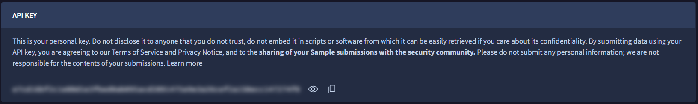  

2) Пишем код скрипта для взаимодействия с VirusTotal через API. Код приведен ниже:

```
import json
import requests
from prettytable import PrettyTable

green = '\033[32m'
red = '\033[31m'
blue = '\033[34m'
reset = '\033[0m'

personal_api_key = 'e7cd16bf2c1e80d1e3fbed0ab095acd2891475e9e3a26cef2a150ecc147274f0'

input_url = str(input(f"{blue}Enter you URL:{reset} "))

virustotal_url_scan = 'https://www.virustotal.com/vtapi/v2/url/scan'
virustotal_url_report = 'https://www.virustotal.com/vtapi/v2/url/report'

scan_data = {
    'apikey': personal_api_key,
    'url': input_url
}

scan_response = requests.post(virustotal_url_scan, data=scan_data)

if scan_response.status_code == 200:
    scan_id = scan_response.json().get("scan_id")

    report_params = {
        'apikey': personal_api_key,
        'resource': scan_id
    }

    report_response = requests.get(virustotal_url_report, params=report_params)

    if report_response.status_code == 200:
        report_result = report_response.json().get("scans")

        result_table = PrettyTable()
        result_table.field_names = ["test", "detected", "result"]

        for key, value in report_result.items():
            if str(value['detected']) == "True":
                result_table.add_row([key, red + str(value['detected']) + reset, value['result']])
            else:
                result_table.add_row([key, green + str(value['detected']) + reset, value['result']])
        print(result_table)
    else:
        print(f"Ошибка в ходе получения отчета: {report_response.status_code}")

else:
    print(f"Ошибка при проверке url: {response.status_code}")

```

3) Далее для проверки работы скрипта вводим URL сайта, например GitHub. Результат работы приведен ниже:

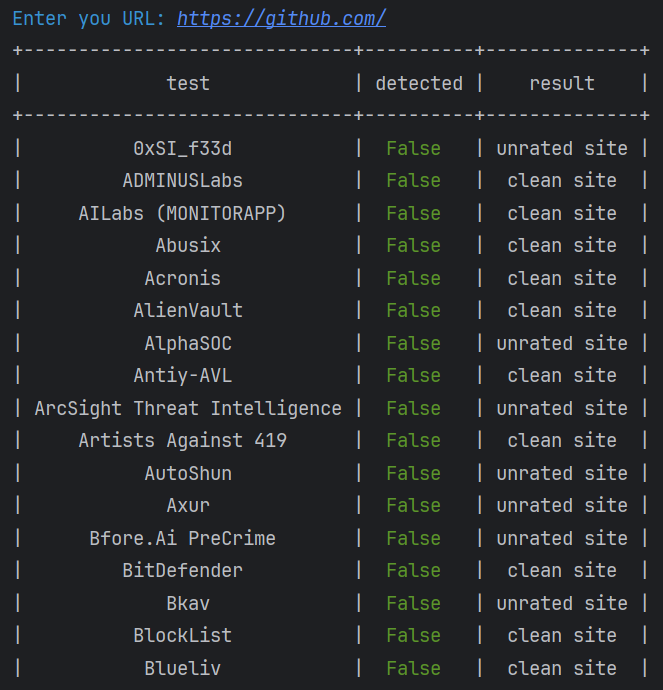  
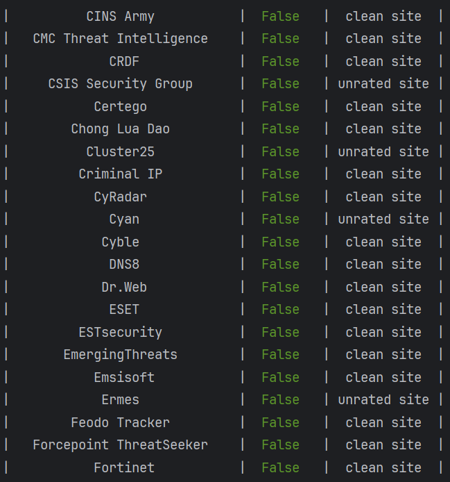
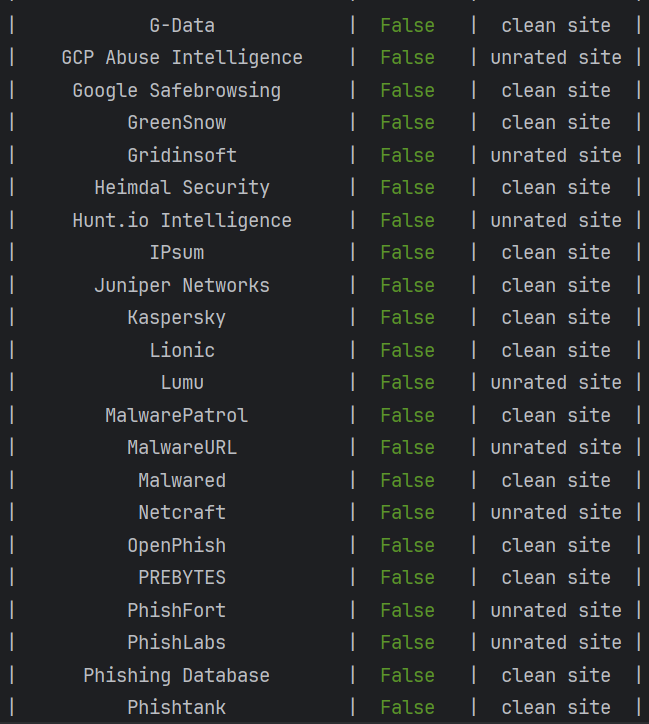
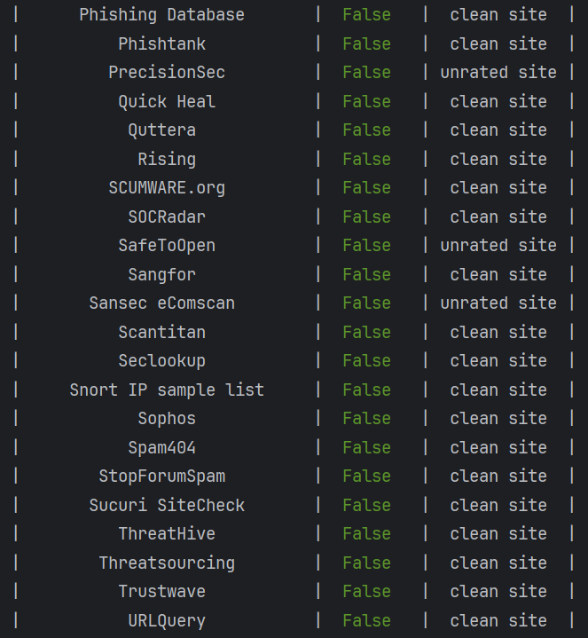
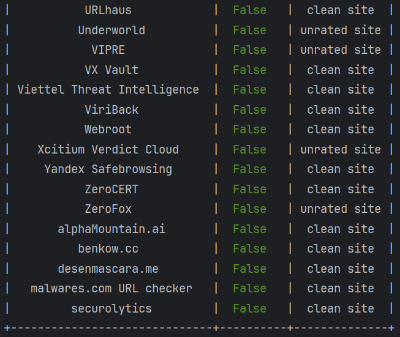  

4) Теперь введем URL сайта, который может вызвать подозрение, например сайт для скачивания игры через торрент. Результат работы приведен ниже:

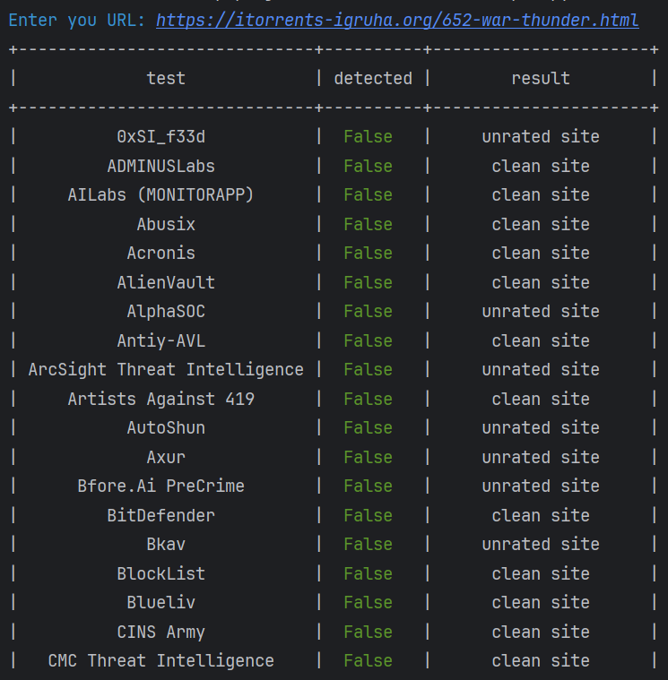  
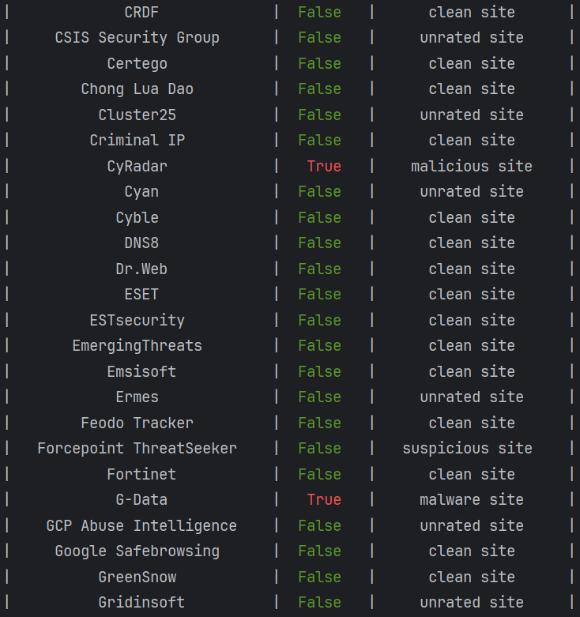
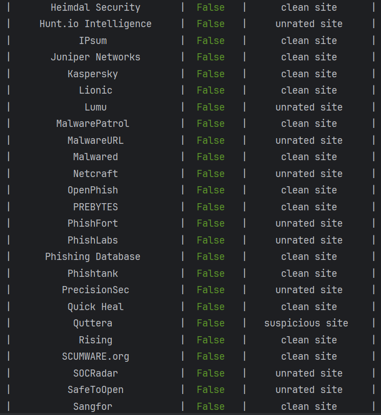
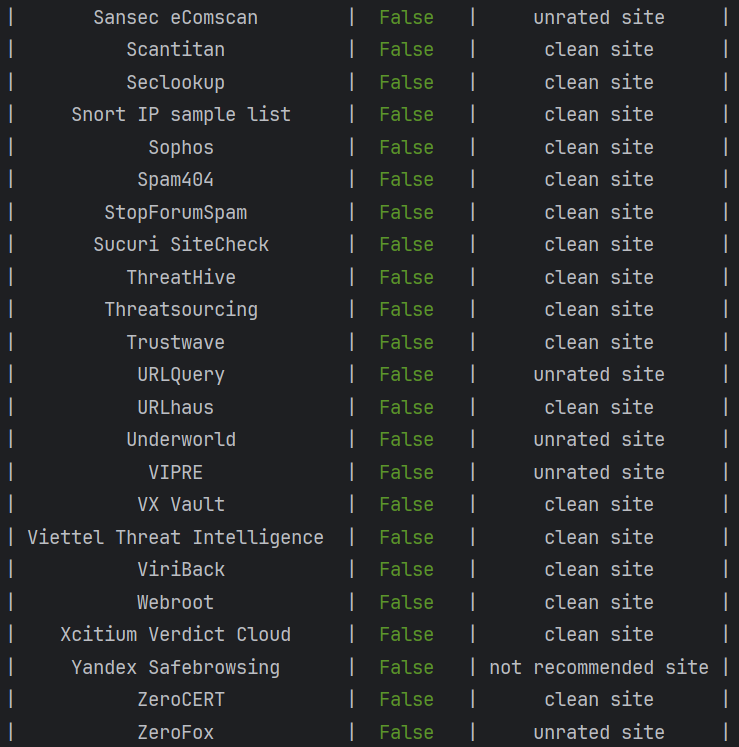
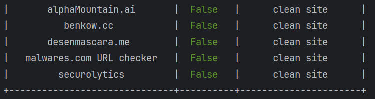  

5) Таким образом, в строках со значением "True", выделенным красным цветом, явно указывает на класс угрозы. Для удобства результаты представлены в виде таблицы.


  
