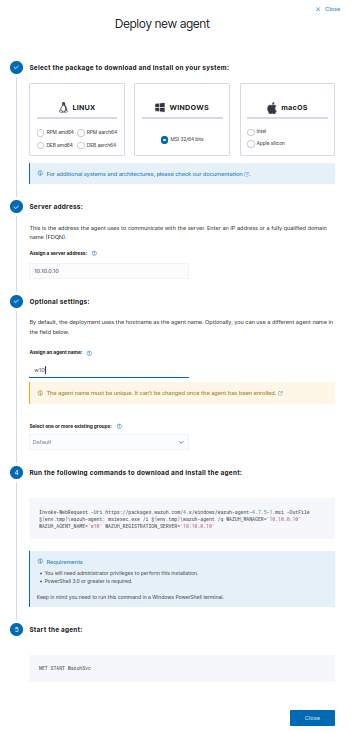
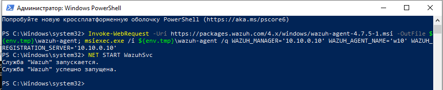
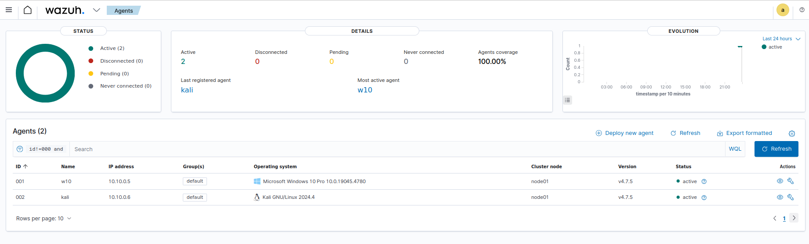

# Настройка SIEM-системы.
  
1) Для решения данной задачи в качестве примера я использую WAZUH. Для установки WAZUH необходимо воспользоваться следующей командой:

  

Стоит отметить, что данная установка является продолжительной. По окончании нам будет доступен логин и пароль для входа в браузере.  
  
  

Далее в адресной строке вводим свой IP-адрес, вводим учетные данные: 

  

2) Далее установим агент Wazuh на Windows 10, для этого есть два варианта: установка через скачивания инсталлера через сайт либо через командную строку. Для установки через скачивание все просто: скачать инсталлер, запустить и установить. После установки запустить агент и установить ip-адрес сервера Wazuh-managment, после чего запустить агент. Для установки через терминал необходимо в GUI перейти на вкладку "Add agent", после чего необходимо выбрать ОС, на которую мы хотим установить агент. Далее вводим необходимые параметры: ip сервера, имя агента и т.д., после чего в результате будет сформирована команда, которую необходимо забить в PowerShell Windows10. После запускаем агент:

  

  

Тоже самое повторяем и для Kali Linux. В результате в списках агентов на сервере отобразятся агенты "w10" и "kali":  

  

