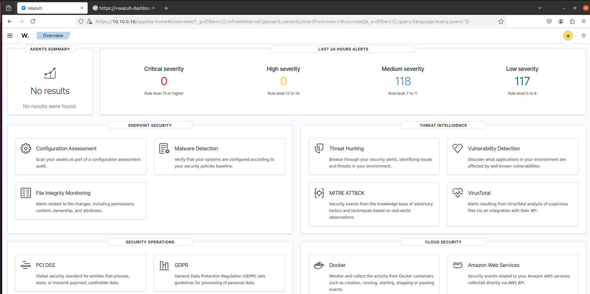

Для установки WAZUH необходимо воспользоваться следующей командой:

  

Стоит отметить, что данная установка является продолжительной. По окончании нам будет доступен логин и пароль для входа в браузере.  
  
  

Далее в адресной строке вводим свой IP-адрес, вводим учетные данные: 

  

