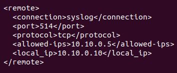

# Настройка SIEM-системы.
  
1) Для решения данной задачи в качестве примера я использую WAZUH. Для установки WAZUH необходимо воспользоваться следующей командой:

  

Стоит отметить, что данная установка является продолжительной. По окончании нам будет доступен логин и пароль для входа в браузере.  
  
  

Далее в адресной строке вводим свой IP-адрес, вводим учетные данные: 

  

2) Далее установим агент Wazuh на Windows 10, для этого есть два варианта: установка через скачивания инсталлера через сайт либо через командную строку. Для установки через скачивание все просто: скачать инсталлер, запустить и установить. После установки запустить агент и установить ip-адрес сервера Wazuh-managment, после чего запустить агент. Для установки через терминал необходимо в GUI перейти на вкладку "Add agent", после чего необходимо выбрать ОС, на которую мы хотим установить агент. Далее вводим необходимые параметры: ip сервера, имя агента и т.д., после чего в результате будет сформирована команда, которую необходимо забить в PowerShell Windows10. После запускаем агент:

  

  

Тоже самое повторяем и для Kali Linux. В результате в списках агентов на сервере отобразятся агенты "w10" и "kali":  

  

3) Далее приступаем к настройкам логов. Начинаем с Windows 10. Открываем конфигурационный файл Wazuh-agent по пути "C:\Program Files (x86)\ossec-agent\ossec.conf" и добавляем в него следующие строки, которые означают мониторинга журналов приложений, безопасности и системы. После чего перезапускаем агент через PowerShell с правами админа.

  
  
Переходим в Ubuntu, открываем конфигурационный файл по пути "/var/ossec/etc/ossec.conf" и добавляем в него следующие строки, которые будут принимать логи от нашего агента "win10" c ip 10.10.0.5 по порту 514 и протоколу tcp. Далее также перезапускаем Wazuh-manager.

  

4) Далее проделываем такие же действия и для агента "kali". Открываем конфигурационный файл по пути "/var/ossec/etc/ossec.conf" и добавляем следующие строки для передачи log-файлов. После чего перезапускаем агент.

  

Далее переходим на Ubuntu и добавляем аналогичные строки теми, что и для агента "win10". Исключения составляе только ip агента, а также порт. После также перезапускаем Wazuh-manager.  

  
  
5) Просматриваем результаты. Дляэ того переходим на вкладку Security events в браузере Wazuh-manager, далее Security allerts. В ней информация представлена в виде таблицы с указанием времени, агента, имени агнета, описания и т.д. Сортируем агентов по названию путем нажатия на заголовок колонки "Agent name":

 

  

 

6) Проверяем результаты работы сервера спустя 2 часа:
  
 

  

