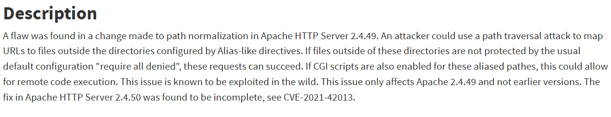

# Обнаружение уязвимости CVE-2021-417773
  
1) Для того, чтобы исправить любую уязвимость, необходимо изучить ее с помощью международных баз уязвимостей, например National Vulnerability Database.
  
  

2) Исходя из данного описания необходимо выявить пути исправления данной уязвимости. В данном случае уязвимость CVE-2021-417773 можно исправить путем:  
* Обновления сервера Apache 2.4.49 до последней стабильной версии (от 2.4.51 и выше, в 2.4.50 уязвимость исправлена не в полном объеме), поскольку данная уязвимость затрагивает только эту версию сервера;
* Установки конфигурации "Require all denied", которая позволит защитить файлы вне корнего каталога, в чем и заключается вся проблем согласно описании уязвимости.

3) Далее приступаем к исправлению уязвимости:
* Обновляем версию сервера Apache до более стабильной:
* Проверяем наличие конфигурации "Require all denied", если ее нет - добавляем:
* 

  

