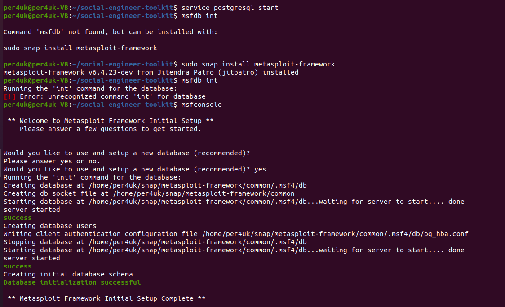

# Социальная инженерия

1) Для начала совместно с установкой setoolkit был установлен metasploit, поскольку часть функционала setoolkit запрашивала установку данного фреймворка. Данные фреймворки были установлены как на Kali Linux, так и Ubuntu.
  
  
  
2) Создание фишингового сайта. Для выполенения данного действия был создан сайт-клон почты mail.ru, после чего, зайдя на него с ВМ Windows 10 были получены данные (логин, пароль) потенциальной жертвы.

  

3) Создание pdf c полезной нагрузкой для "прослушивания" пк жертвы. В результате был создан pdf-файл, однако его не получилось отправить по почте в виду его содержимого.  
  
  

  

4) Реализация целевого фишинга в виде отправление письма жертве, о которой предварительно собирались данные с целью достижения своих целей посредством невнимательности жертвы. (update.exe также не получилось отправить из-за его содержимого)
  

