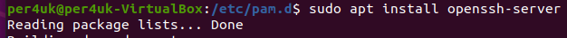
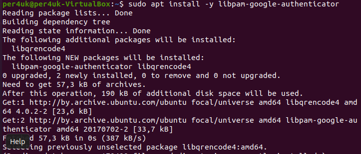
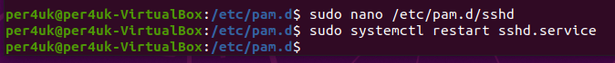
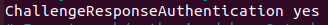

# Урок 18. Защита инфраструктуры приложений  

 ## ***Домашняя работа*** ##  
1) Установка ssh-server:  
  
  

Установка 2FA:

  
  
Настройка 2 fa путем добавления строки "auth required pam_google_authenticator.so" в файл /etc/pam.d/sshd c последующим перезапуском демона ssh и добавление возможности запроса кода аутентификации при входе в систему путем установления параметра ChallengeResponseAuthentication в положение yes:

  
  
  
Настройка Google Authenticator для генерации кодов TOTP путем установки параметров.Также нам представлен QR-code и секретный ключ:  

  

  

