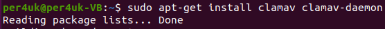
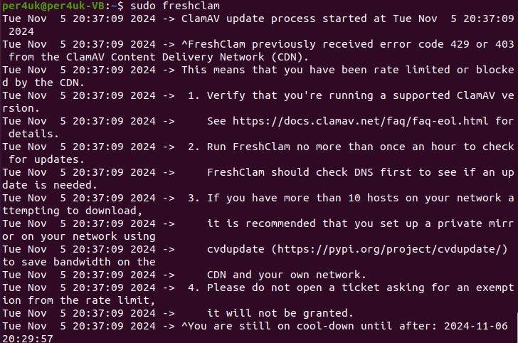
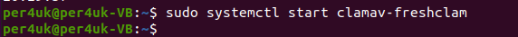
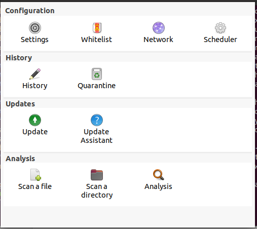
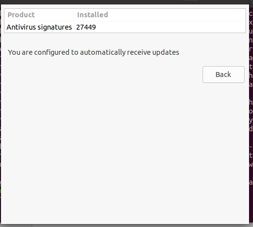
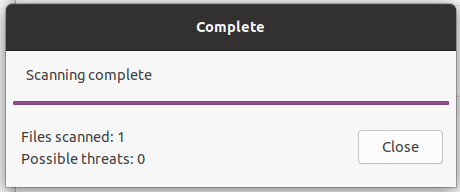
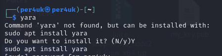
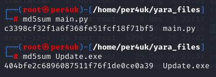
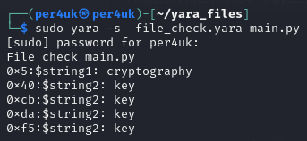

# Урок 19. Основные виды СЗИ  

 ## ***Домашняя работа*** ##  
1) Установка ClamAV:  
  
  

Далее останавливаем сервис командой sudo systemctl stop clamav-freshclam для обновления баз данных и вводим команду автообновления:
  
  
  
Далее запускаем сервис:  
  
  
  
Запуск сканирования в терминале:  
  
 
  
Установка GUI вводом команды sudo apt install clamtk, обновление БД в GUI:  
  
  
  
  
Сканирование файла:  
  
  

2) Установка YARA.

  

Предполагается, что злоумышник знает про папку с важными документами на нашем ПК. Для того, чтобы нанести ущерб нашей компании он создал 2 зловреда: 1 - .exe с обновлением
программы, которая имеется в нашем ПК, полученный посредством социальной инженерии через email от вегдора ПО; второй - скрипт, который попросил запустить и проанализировать наш "друг", который был взломан накануне. .exe - шифрует папку "Документы" по заданному ключу, а .py - также шифрует данную папку.  Hash данных файлов представлен ниже:  

  

Проверка данных файлов с помощью написанных правил YARA:  

  

  

  

