# Урок 22. Vulnerability Assessment 

 ## ***Домашняя работа*** ##  
1) Установка OpenVAS и запсук службы:  
  
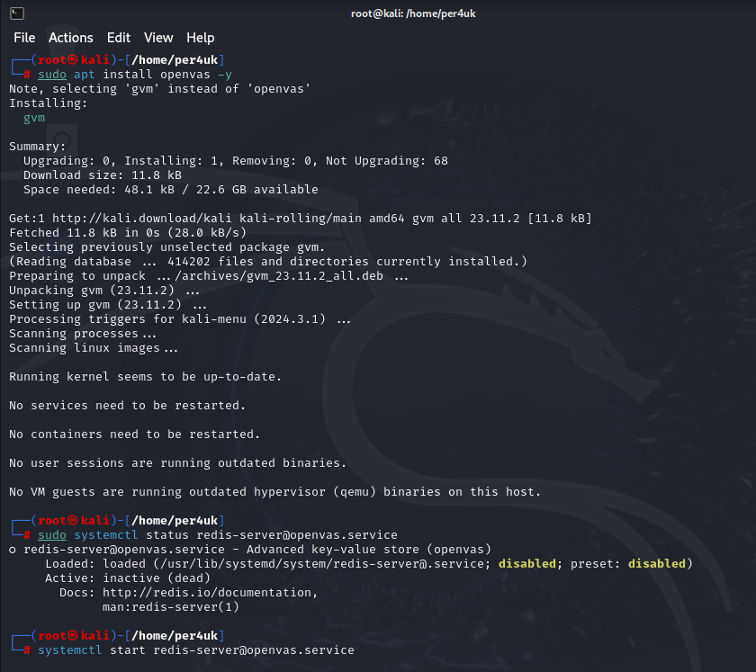  

Проверка состояния службы:

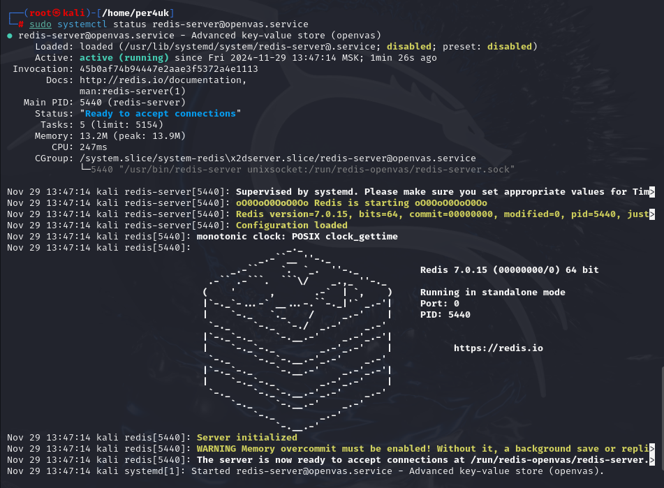  

Запуск настройки gvm командой "sudo gvm-setup". По окончании отобразиться логин и пароль, которые надо запомнить! Далее проверяем установку командой "sudo gvm-check-setup", доустанавливаем необходимые пакеты.

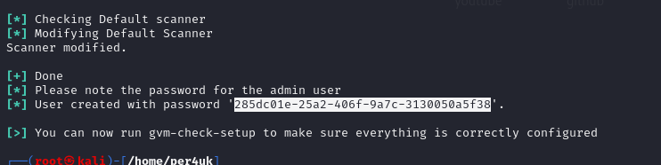  
  
Когда установка закончится и все необходимое будет установлено, отобразится строка:  

 
  
Включение помощника:  

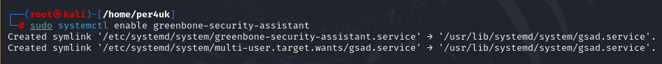  

Создание новых правил для FIN и SYN путем добавления текстового файла в папку /etc/suricata/rules:  

  

Обновление службы:  

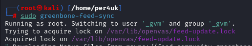

Далее переходим в браузер, вводим адрес из документации, а также данные для входа, которые мы запомнили. После этого мы увидим рабочее пространство:  

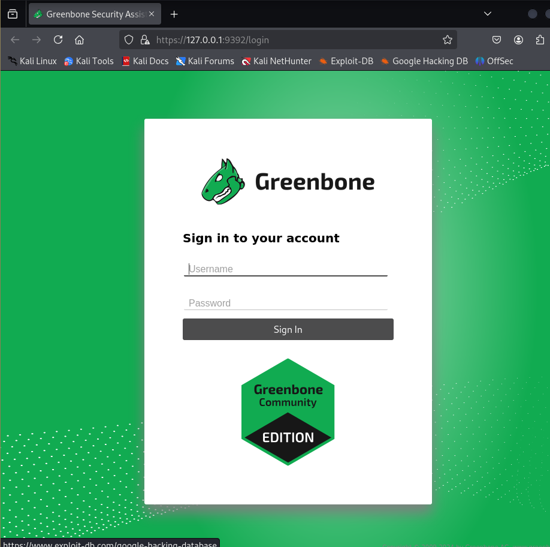  

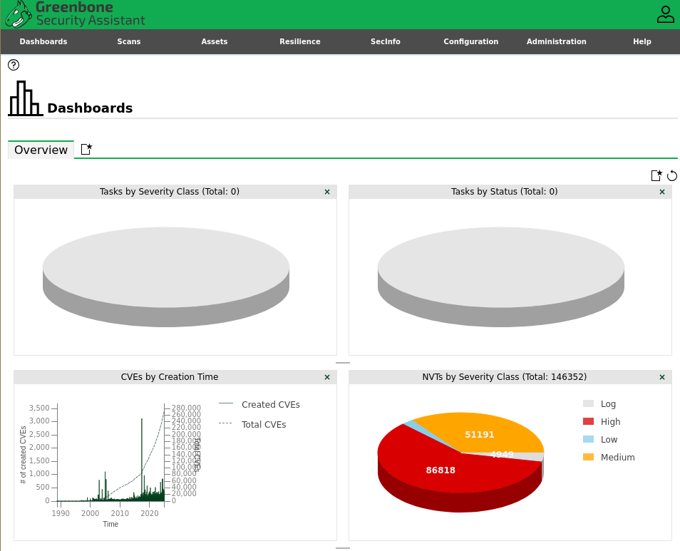 

Для тестирования данной службы просканируем ВМ UBUNTU. Для этого сформируем задание. Результаты следующие:  
  
  

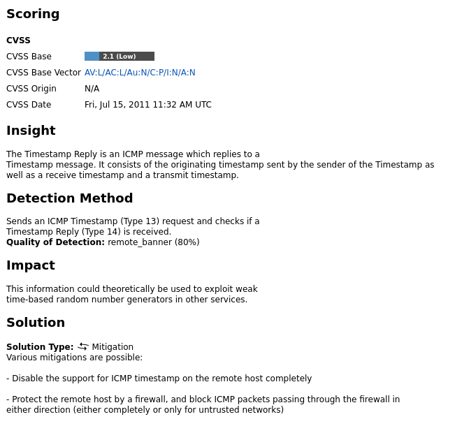

2) Установка PatrOwl. Создаем папку, в которую клонируем проект:

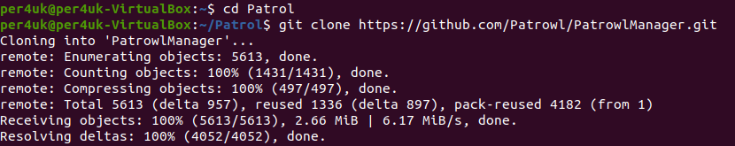  

Далее развертываем backendс помощью Docker-compose:  

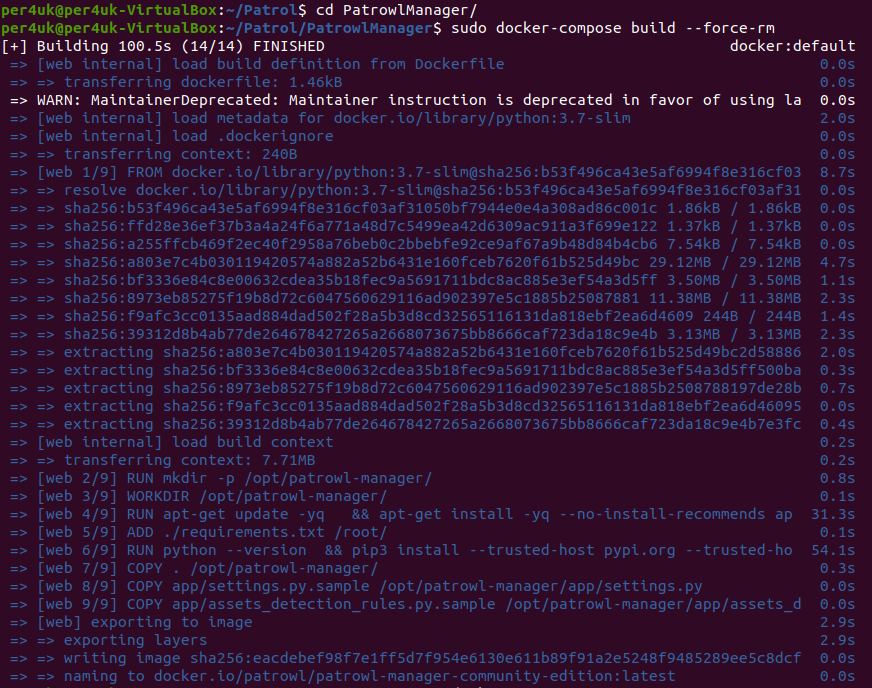  

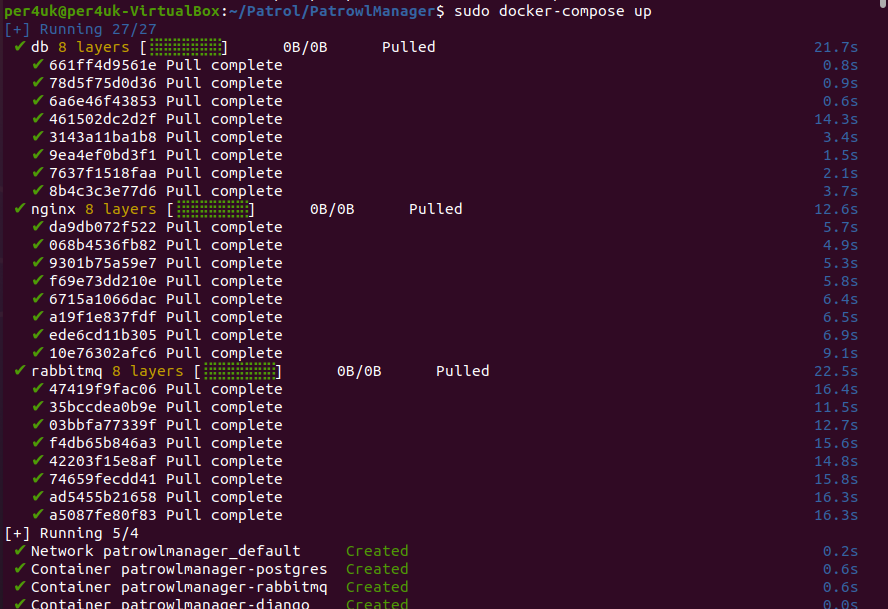  

Далее заходим в браузер, вводим "http://localhost:8083/", после чего вводим учетные данные (логин: admin, пароль: Bonjour1).

  

