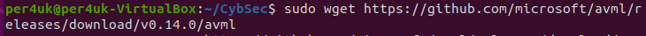
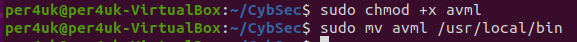
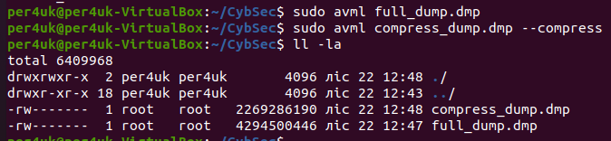
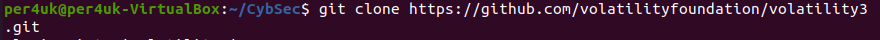
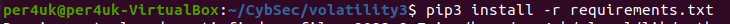
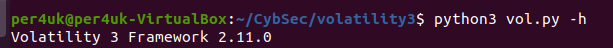
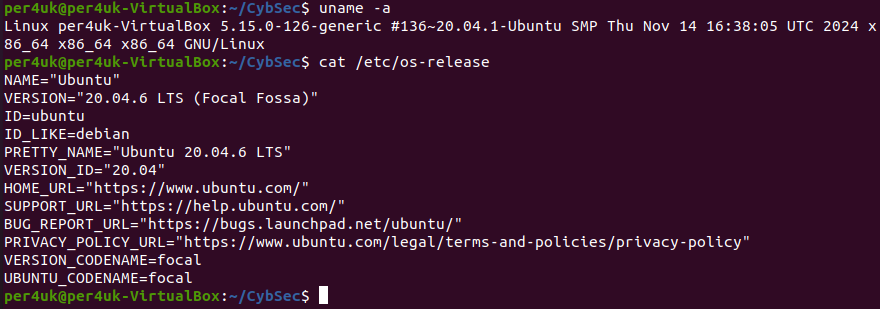

# Урок 24-25. Forensics, Incident response  

 ## ***Домашняя работа*** ##  
1) Установка AVML:  
  
  

Далее необходимо дать скрипту разрешение на исполнение и переместить его в /usr/local/bin:
  
  
  
Создаем дампы, один полный и сжатый:  
  
  
  
Устанавливаем volatility:  

  

Устанавливаем необходимые пакеты из requirements.txt:  

  

Просматриваем необходимые плагины:  

  

Просмотр параметров ядра:  

  

Далее показана ошибка, которая возникает на данном этапе:  

  

Данная ошибка связана с символами ядра. Данные символы не получилось установить.

  

