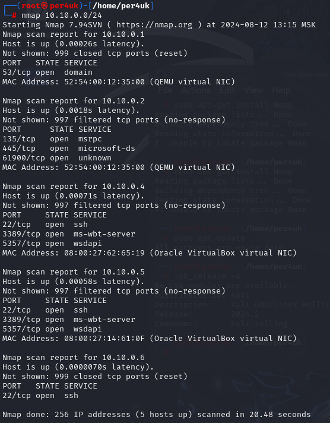
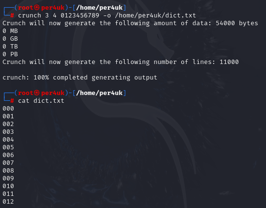

# Урок 3. Kali Linux

### ***Kali Linux*** ###
Cпециализированный дистрибутив Linux, предназначенный для пентеста с упором на сети. Он включает в себя множество предустановленных инструментов для оценки безопасности компьютерных систем. Разработан и поддерживается компанией Offensive Security.  
Основные инструменты:    
• Nmap : Сканер сетей и портов.  
• Wireshark : Анализатор сетевых.  
• Metasploit Framework: Платформа для разработки и выполнения эксплойтов.  
• Aircrack ng : Набор инструментов для аудита безопасности Wi Fi.  
• John the Ripper: Утилита для взлома паролей.  
• Burp Suite: Средство для тестирования безопасности веб приложений.    
Особенности:    
• Основан на Debian.  
• Поддерживает LiveCD USB.  
• Пакетный менеджер dpkg.  
• Системные требования:
  1+ GB RAM.
  20+ GB ROM.

### ***Основные директории*** ###
  
1. /(корнень). Главная директория файловой системы Все остальные директории расположены под корнем.
2. /bin. Содержит важные системные бинарные файлы (исполняемые программы), которые необходимы для работысистемы, например, ls, cp, mv.
3. /sbin. Содержит системные бинарные файлы, например, ifconfig reboot.    
4. /usr. Содержит пользовательские программы и утилиты.    
    /usr/bin - Бинарные файлы программ.    
    /usr/sbin - Системные утилиты для администрирования.    
    /usr/lib - Библиотеки программ.    
5. /etc. Содержит конфигурационные файлы системы и программ.    
    /etc/fstab - Таблица монтирования файловых систем.    
    /etc/passwd - Информация о пользователях.    
    /etc/hosts - Локальная таблица сопоставлений имен и IP адресов.    
6. /var. Хранит изменяющиеся данные, такие как журналы и временные файлы.   
    /var/log - Лог файлы системы и приложений.  
    /var/tmp - Временные файлы, которые сохраняются между перезагрузками.  
7. /home. Содержит домашние каталоги пользователей.  
    /home/username - домашний каталог пользователя username.  
8. /root. Домашний каталог пользователя root (суперпользователя.

### ***Важные конфигурационные файлы*** ###

1. /etc/hostname. Содержит имя хоста системы.  
2. /etc/hosts. Локальная таблица сопоставлений IP адресов и имен хостов.  
3. /etc/resolv.conf. Настройки DNS серверов.  
4. /etc/network/interfaces (или etc/netplan/*. yaml). Настройки сетевых интерфейсов.  
5. /etc/fstab. Конфигурация для автоматического монтирования файловых систем.  
6. /etc/passwd. Информация о пользователях системы.  
7. /etc/shadow. Хеши паролей пользователей.  
8. /etc/sudoers. Настройки для утилиты sudo.  
9. /etc/systemd/system. Пользовательские файлы для управления службами и настройками systemd.  
10. /etc/apt. Конфигурация и источники для управления пакетами через apt.

### ***Команды для работы с файловой системой ОС*** ###
1) ls - просмотр файлов (ll, la).  
2) cd - перемещение по каталогам (.. , ../../ , /bob/data/).  
3) mkdir - создание директории пути (bob, bob/data/video).  
4) rm - удаление файла/диреткории ( -r /dir , filename.txt).  
5) mv - перемещение файла каталога (source destination).
6) cp - копирование (по аналогии с mv).  
7) lsblk - информация о устройствах хранения(-f).  
8) df - информация о файловых системах (-h).  
9) pwd - информация о текущем каталоге.  
10) which - информация о расположении команды или сценария.

### ***Команды для работы с файлами в ОС*** ###   
1) cat - вывод для чтения: cat file.txt.  
2) nano - редактирование файл: nano file.txt.  
3) vim - редактирование файл: vim/vi file.txt.  
4) touch - создание файл: touch file.txt.  
5) tail - вывод последних строк: tail n 20 f file.txt.  
6) head - вывод первых строк: head n 20 f file.txt.  

### ***Команды для управления состоянием ОС*** ###   
1) reboot - перезапуск reboot.  
2) shutdown - выключение shutdown now.

### ***Модификаторы доступа*** ### 
|двоичная|символьная|права на файл|права на каталог|
|---|---|---|---|
|000|---|нет|нет|
|001|--x|выполнение|чтение свойств файлов|
|010|-w-|запись|нет|
|011|-wx|запись и выполнение|всё, кроме получения
имени файлов|
|100|r--|чтение|чтение имён файлов|
|101|r-x|чтение и выполнение|доступ на чтение файлов/их свойств|
|110|rw-|чтение и запись|чтение имён файлов|
|111|rwx|все права|все права|  

## ***Домашнее задание*** ##
1. Установка SSH-server на Window_Pro.
     
     
2. Установка SSH-server на Window_Server.
     
     
3. Сканирование портов Nmap.
   
     
4. Генерирование словаря с помощью Crunch.
   
   
  
5. Подбор пароля Hydra по ранее составленному словарю (был создан более простой словарь, чем на скриншоте выше для уменьшения времени перебора).
   
     
   
