# Урок 13. Безопасность Windows OS

## ***Домашнее задание:*** ##  

1. Заходим в ServerManager. Далее Manage->Add roles and features, устанавливаем на Role-based or features-based installation, далее выбираем сервер, указываем AD Domain Service, указываем доменное имя и нажимаем установку:  
  
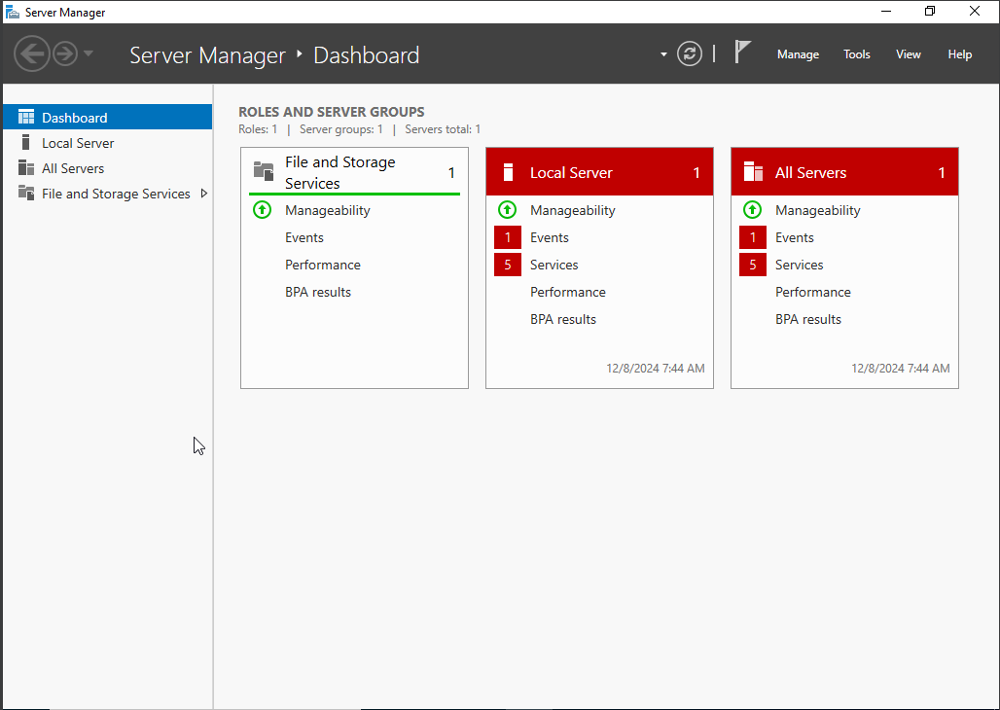  

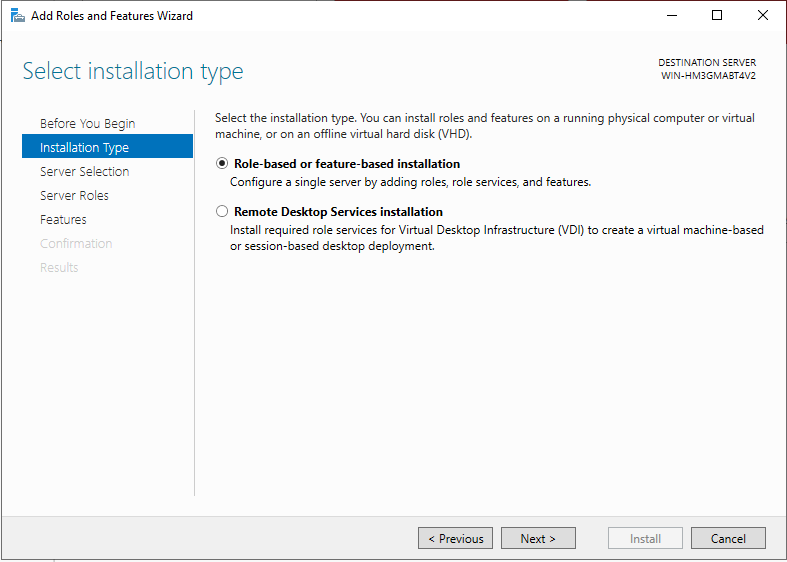  

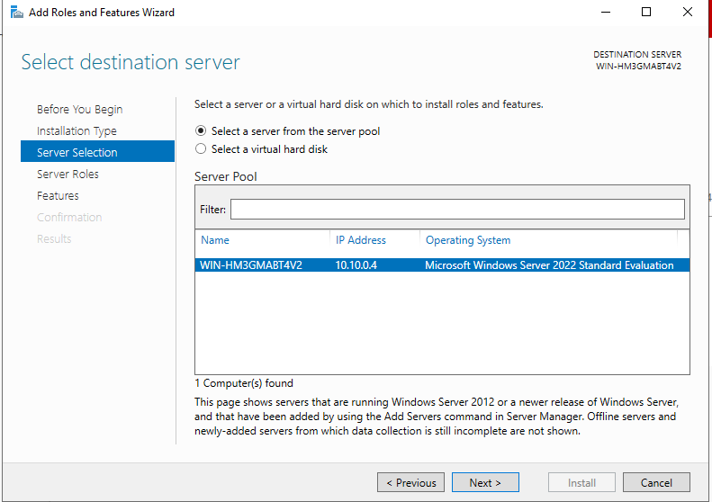  

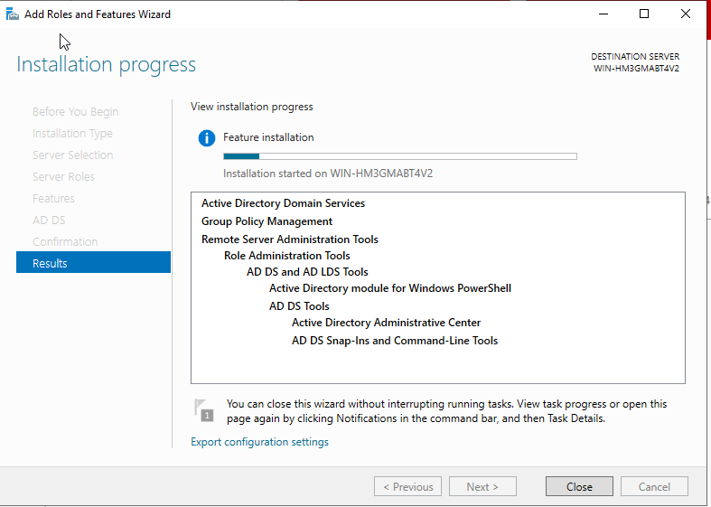  

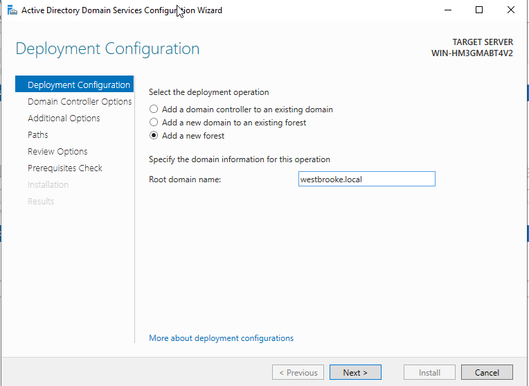  
  
Меняем имя компьютера на ns1. Результат по первому пункту:

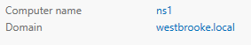  

2) Устанаваливаем DNS-сервер таким же образом, как и AD: Manage->Add roles and features, устанавливаем на Role-based or features-based installation, далее выбираем сервер, указываем DNS Server, и нажимаем установку. Переходим в Tools, DNS, выбираем FORWARD LOOKUPZONES и основной домен (в моем случае - westbrooke.local). Там создаем записи через New Record, Host A, далее запполняем форму с указанием имени хоста и его IP:

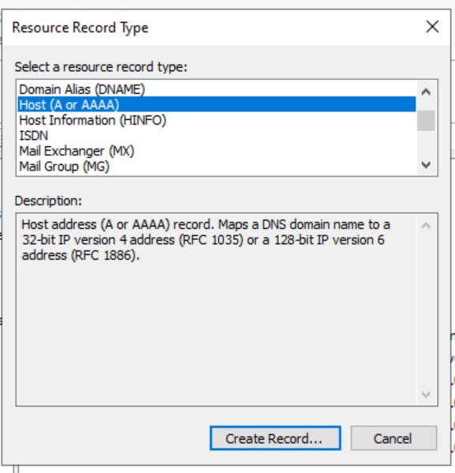  

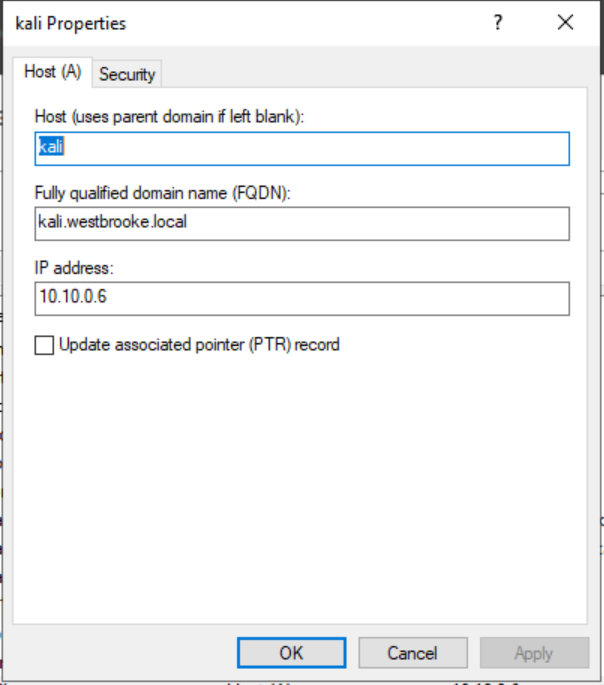  

Также заполняем и для ubuntu (host - ubuntu, ip - 10.10.0.10). Далее пингуем доменное имя на примере ubuntu:  

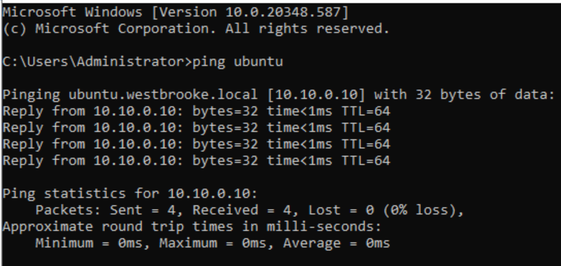  

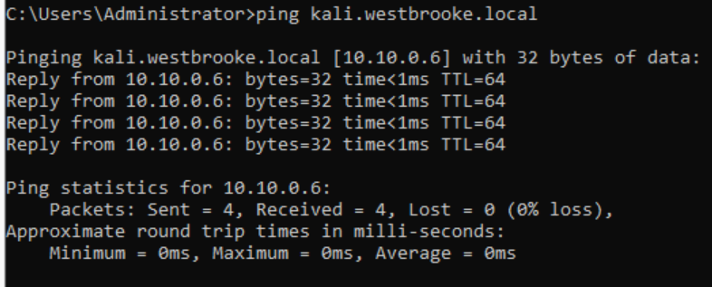  

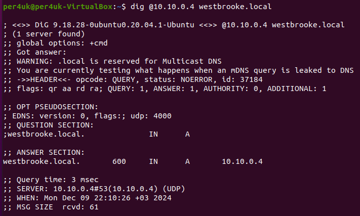  

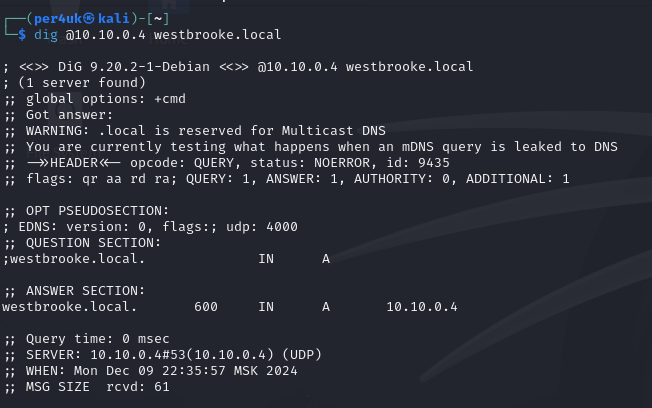

  
