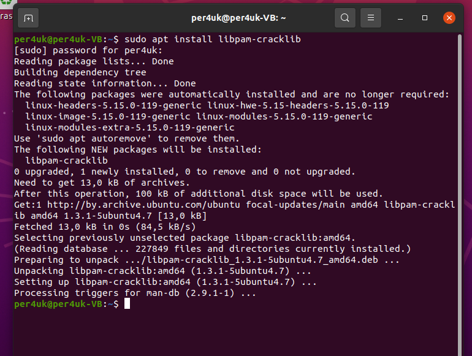
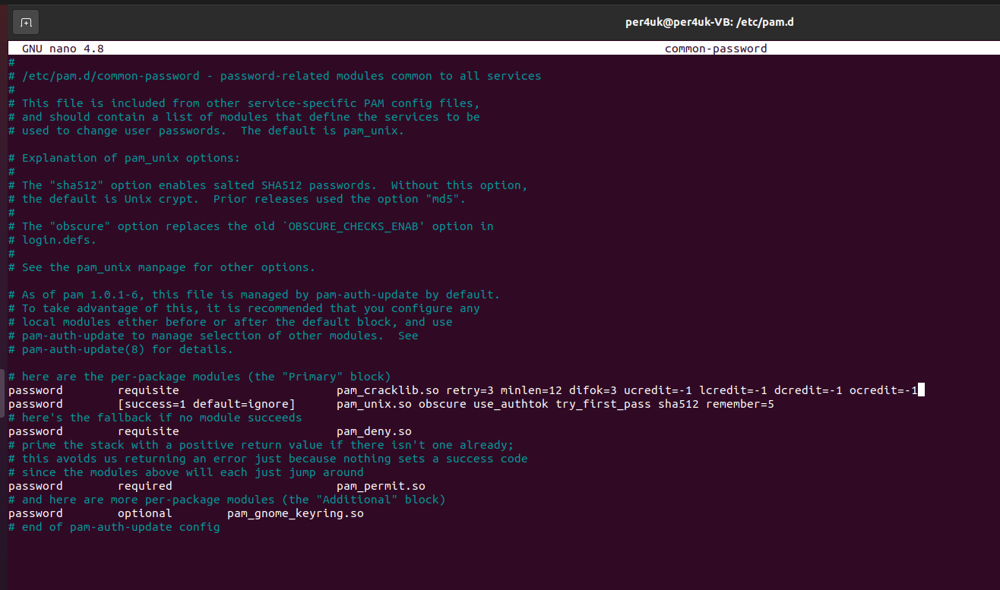
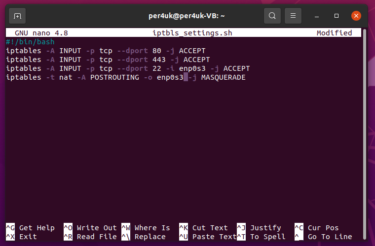
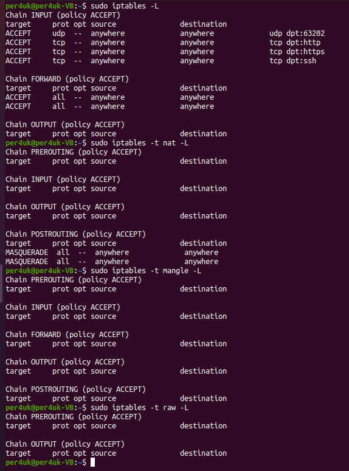
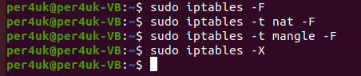
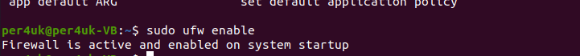
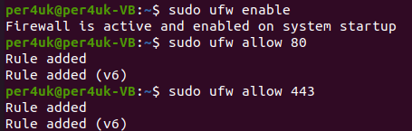
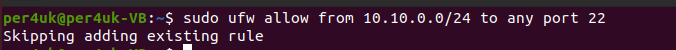

# Урок 14. Безопасность Linux OS

### ***GNU (GNU’s NGNUot UNIX )*** ###  
  
Cвободная Unix-like операционная система, разрабатываемая Проектом GNU.  

Linux использует монолитное ядро, которое потребляет больше ресурсов, в то время как Windows использует гибридное ядро, которое занимает меньше места, но при этом снижает эффективность работы системы, в отличие от Linux. В Microsoft Windows файлы хранятся в каталогах/папках на разных дисках. В Linux файлы и папки, начиная с корневого каталога, упорядочены в виде древовидной структуры, разветвляясь на различные подкаталоги.  

### ***Cron*** ###  

Это классический Unix-daemon, использующийся для периодического выполнения заданий в определенное время.  
Особенности:  
• Задания хранятся в специальных файлах в определенном формате.  
• Поддерживается возможность запуска заданий от имени разных пользователей.  
• Системные задания кладутся в /etc/crontab.  
• Задания пользователей – в /var/spool/cron/crontabs.  

### ***SELinux*** ###  

Это система принудительного контроля доступа, реализованная на уровне ядра.    
1. Метки безопасности:  
Каждый процесс, файл и объект в системе помечается меткой безопасности.  
2. Политики безопасности:  
SELinux использует набор политик безопасности, которые указывают, какие действия разрешены или запрещены.  
3. Принудительный контроль доступа:  
SELinux принимает решения о доступе к ресурсам на основе политик безопасности и меток безопасности.

## ***Домашнее задание:*** ##  

1. Установка модуля Cracklib PAM.
  
  
  
2. Внесение изменений в конфигурационный файл.
  
  

3. Настройки iptables до скрипта.
  
 
  
4. Скрипт для настройки iptables.
  
  
  
5. Настройки iptables после скрипта.
  
 
  
6. Очистка правил, установленных скриптом.  
  
  

7. Запуск ufw.
  
  
  
8. Настройка правил для ufw.

  

  
