# Урок 15-16. Защита инфраструктуры предприятия

1. Устанавливаем DHCP таким же образом, как и DNS в Лекции №14: Manage->Add Roles and Features, в одном из пунктов указываем DHCP.  
  
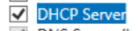   
  
Далее нажимаем Tools->DHCP для настройки DHCP, далее ищем домен, нажимаем IPv4 и кликаем на значок New Scope. Далее вводим необходимые параметры, такие как: название настройки, пул разрешенный адресов, пул запрещенных адресов и т.д. На рисунке ниже изображено меню укзаание пула адресов, я указываю пул 10.10.0.20 - 10.10.0.30, при этом адрес сервера - 10.10.0.4.  
  
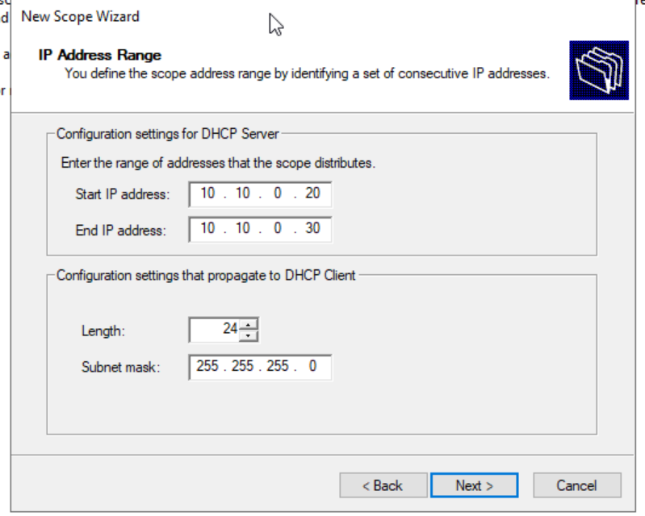  
  
После напротив названия наших настроек отобразиться Active!, что означает, что наши настройки были успешно запущены.  
   
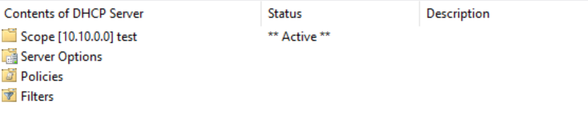   

Заходим на ВМ Windows 10 Pro, находящийся в этой же сети. Добавляем ВМ в домен westbrooke.local и меняем название на windows10.  

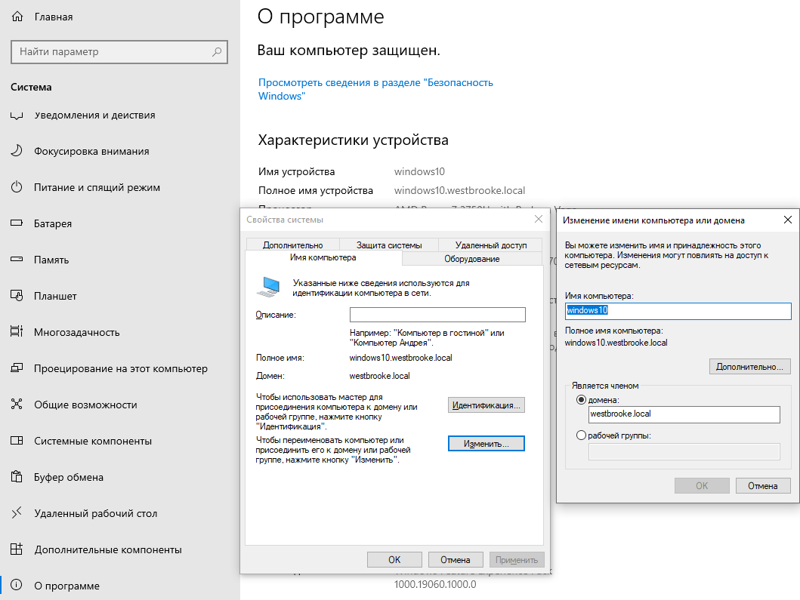  

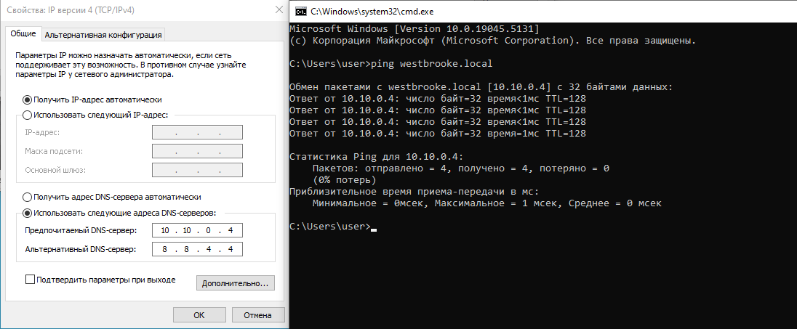  

Проверяем адрес:  

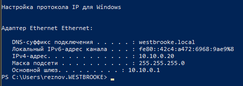  

2)   Заходим в Active Diretory and Computers.

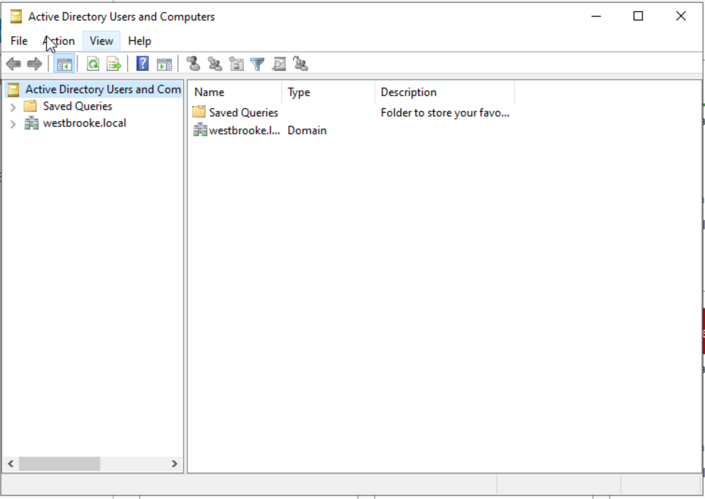  

Кликаем New Organization Unit, вводим название:  

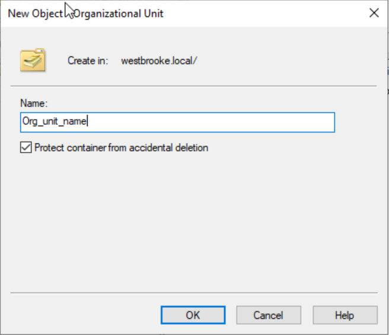  

Кликаем по новому OU, внутри него создаем 2 новых : fin и hr. Далее создаем по 2 пользователя в каждом из них, нажимаем New User и заполняем данные и пароли:  

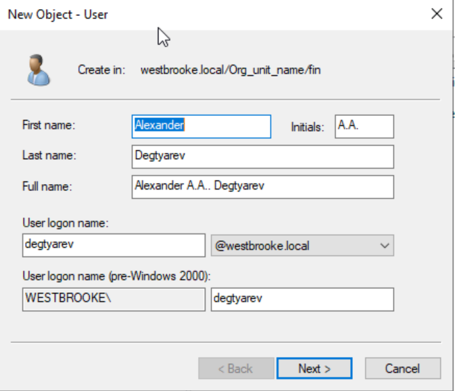  

Проверяем:  

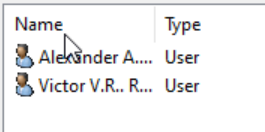  

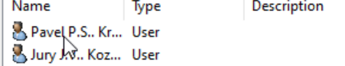  

Далее кликаем по двум вложенным OU, нажимаем New GPO, указываем название для каждой политики:  

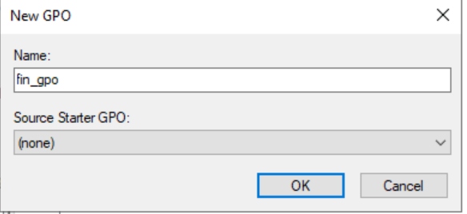  

Переходим по пути, указанному на рисунке ниже, нажимаем Password Policy, и указываем параметры пароля согласно заданию каждому OU, также указываем время блокировки экрана в результате неактивности:  

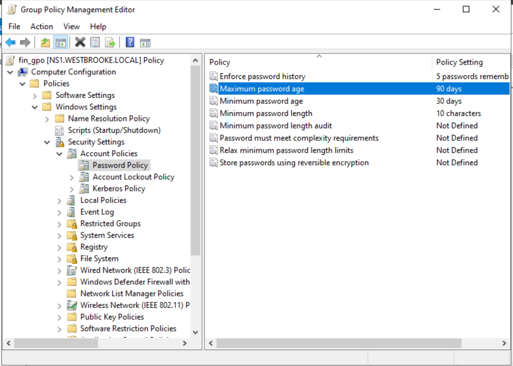  

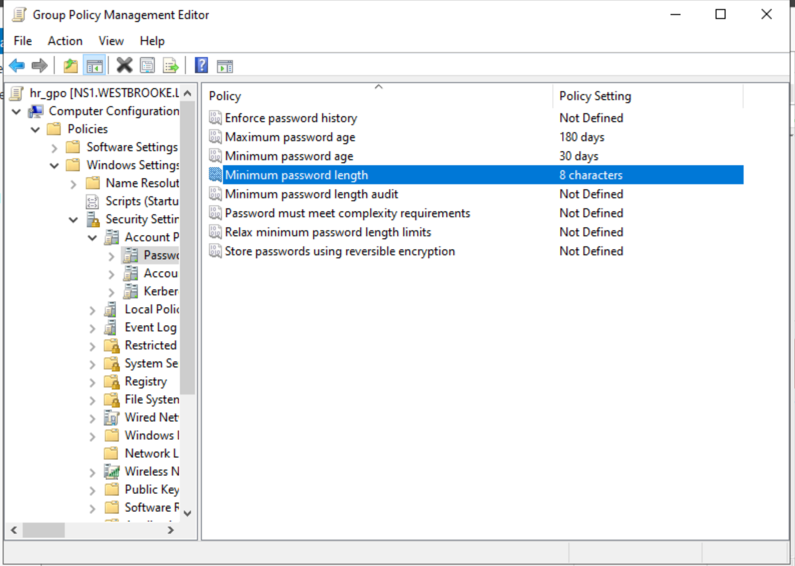  

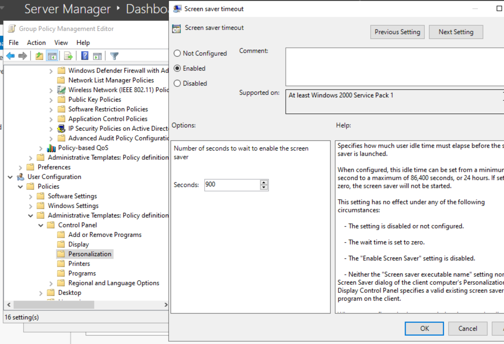 

Заходим под одним из пользователей и проверяем, какие политики применены:  

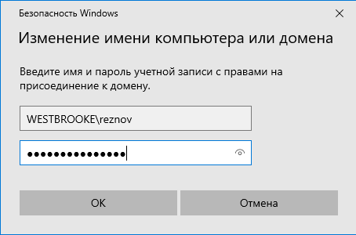  

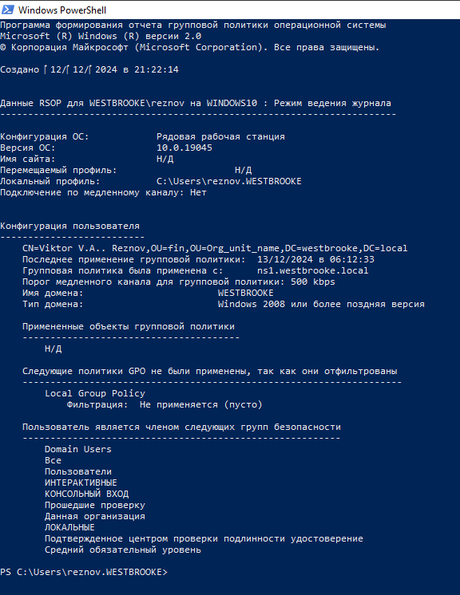 

  

