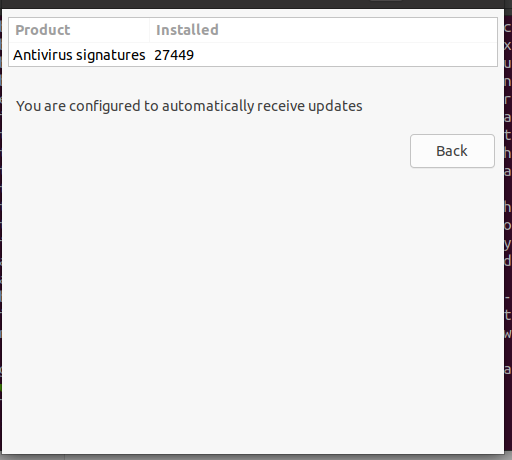

# Урок 19. Основные виды СЗИ  

 ## ***Домашняя работа*** ##  
1) Установка ClamAV:  
  
  

Далее останавливаем сервис командой sudo systemctl stop clamav-freshclam для обновления баз данных и вводим команду автообновления:
  
  
  
Далее запускаем сервис:  
  
  
  
Запуск сканирования в терминале:  
  
 
  
Установка GUI вводом команды sudo apt install clamtk, обновление БД в GUI:  
  
  
  
  
Сканирование файла:  
  
 

  
Настройка 2 fa путем добавления строки "auth required pam_google_authenticator.so" в файл /etc/pam.d/sshd c последующим перезапуском демона ssh и добавление возможности запроса кода аутентификации при входе в систему путем установления параметра ChallengeResponseAuthentication в положение yes:

  
  
  
Настройка Google Authenticator для генерации кодов TOTP путем установки параметров.Также нам представлен QR-code и секретный ключ:  

  

  

