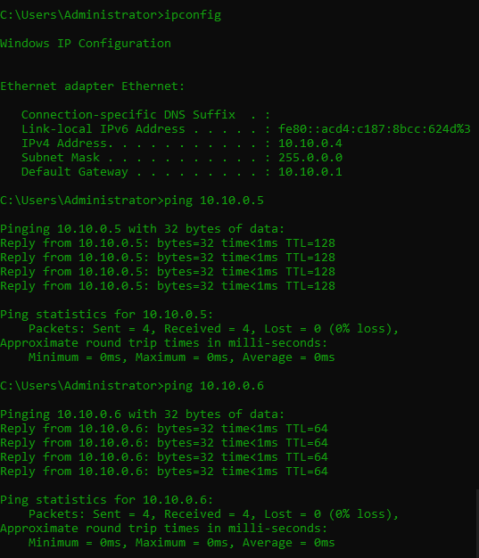
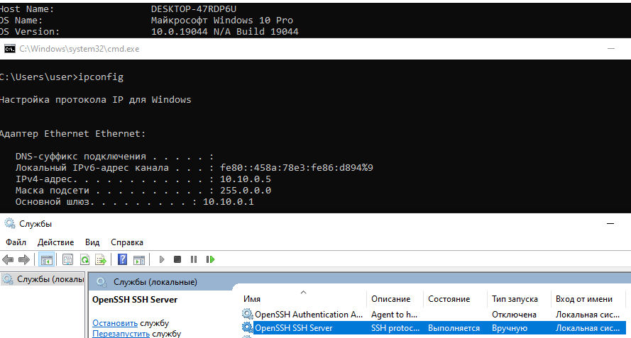
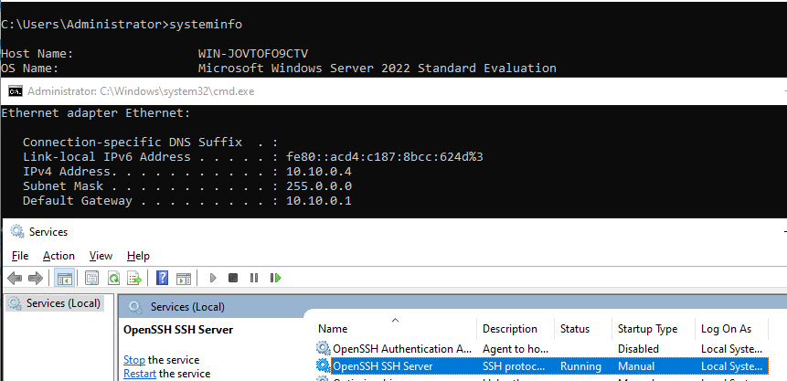
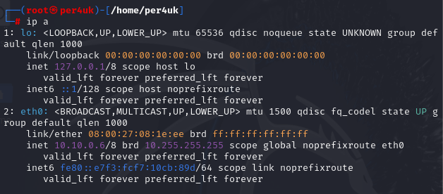

# Урок 2. Виртуализация

### ***Виртуализация*** ###
Технология, которая позволяет создать виртуальные версии различных компьютерных ресурсов, таких
как операционные системы, серверы, хранилища данных и сети. Была разработана в 60 х но, использовалась как как
технический эксперимент В конце 90 х, начала широко применяться для создания нескольких ВМ на одной аппаратной платформе.

### ***Хост система*** ###
Система это основная ОС, в рамках которой происходят создание и функционирование
изолированной виртуальной среды.

### ***Гостевая ОС*** ###
ОС, которая работает внутри изолированной виртуальной среды.

### ***Гипервизор*** ###
• В веб хостинге: Виртуализация позволяет создать на одном сервере несколько изолированных ВМ.  
• В разработке: С помощью виртуализации можно создать на рабочей платформе изолированные виртуальные среды для
тестирования приложений, влияющих на настройки операционной системы. Виртуализация помогает в тестировании в различныхсредах.  
• В кибербезопасности: Используется для тестирования подозрительных файлов, ссылок и для изучения экземпляров ВПО.  
• В игровой индустрии: Виртуализация позволяет создавать на мощных серверах игровые среды. Пользователи могут за плату играть в требовательные игры на маломощных.

### ***Типы виртуализации*** ###
• Тип 1: Bare Metal. Устанавливаются прямо на оборудование (VMware ESXi, Microsoft Hyper V).  
• Тип 2: Hosted. Работают поверх хостовой операционной системы( Oracle VM VirtualBox, VMware Workstation).

### ***Вендоры виртуализации*** ###
•Сетевая виртуализация (VMware NSX, Cisco ACI): виртуальные сети, которые могут функционировать
независимо от физической сети.  
•Виртуализация хранилища (VMware vSAN, MicrosoftStorage Spaces): объединение физического хранилища нескольких устройств в виртуальное хранилище.  
•Виртуализация рабочего стола (VMware Horizon CitrixVirtual Apps and Desktops): доступ пользователей к виртуальным desktop средам, которые работают на удаленных серверах.
•Облачные вычисления (Облачные провайдеры, такие как Amazon Web Services, Microsoft Azure и Google Cloud Platform): используют виртуализацию для предоставления масштабируемых и гибких сервисов.

### ***Преимущества виртуализации*** ###
1)Эффективное использование ресурсов  
2)Упрощение управления  
3)Повышение доступности и отказоустойчивости  
4)Гибкость и масштабируемость  
5)Изоляция и безопасность  
6)Быстрое развертывание  
7)Мониторинг и отчетность  
8)Репликация ВМ  
9)Кластеризация и балансировка нагрузки  
10)Запуск устаревших систем  

### ***Снапшоты*** ###
Снимки состояния ВМ в определенный момент времени, позволяющие сохранить текущее состояние ВМ, включая данные на диске, состояние оперативной памяти и настройки конфигурации.  
Состав:  
- Снимок состояния диска. Сохраняет текущее состояние виртуальных дисков.  
- Снимок состояния памяти. Сохраняет текущее состояние оперативной памяти, что позволяет возобновить ВМ с тем же состоянием, в котором она.  
- Снимок состояния процессора. Сохраняет текущее состояние регистров процессора и других аппаратных компонентов.

## ***Домашнее задание*** ##
1. Создание локальной сети по заданной преподавателем структуре и настройка соотвествующих параметров.
     
   
  
2. Состояние ВМ Window_10_Pro.
     
   
     
4. Состояние ВМ Window_server.
      
   
     
6. Состояние ВМ Kali_Linux.
     
     

