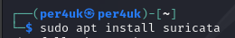
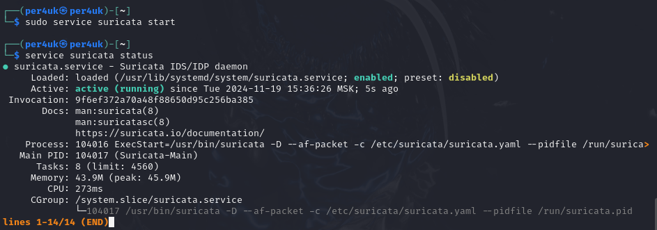
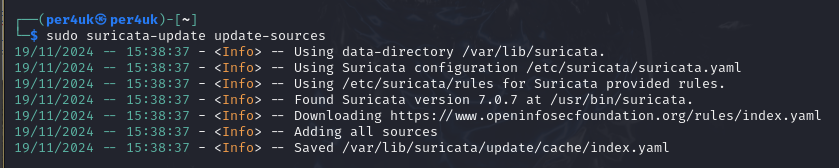
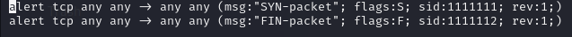
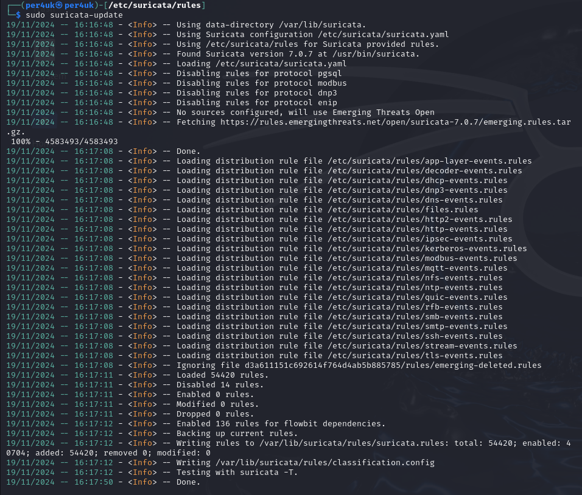
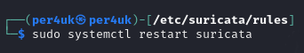
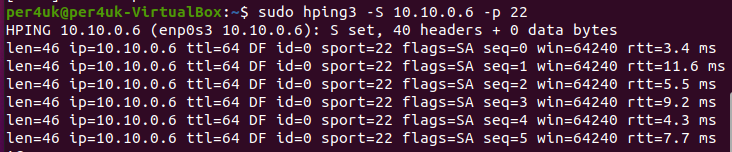
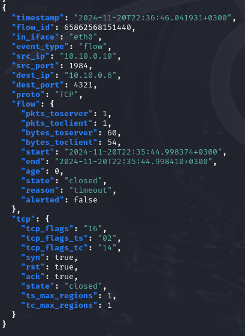

# Урок 20. Основные виды СЗИ  

 ## ***Домашняя работа*** ##  
1) Установка Suricata:  
  
  

Запуск Suricata:

  
  
Обновление правил Suricata:  

  

Создание новых правил для FIN и SYN путем добавления текстового файла в папку /etc/suricata/rules:  

  

Обновление правил Suricata с учетом новых:  

  

Перезапуск Suricata:

  

Для тестирования работы Suricata установим h3pings на ВМ Ubuntu, с которой будем генерировать Syn-пакеты и отправлять их на ВМ Kali Linux:  

  

Открываем файл логов Suricata с помощью jq и видим следующую запись,  в котором и отображается информация по перехвату Syn-пакета с указанием адресов, портов и протокола:  

  

  

