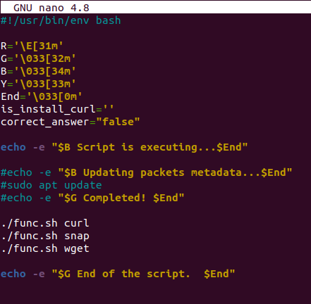
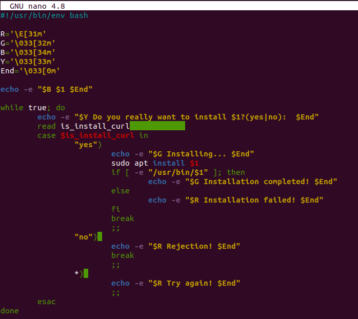
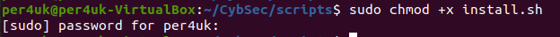
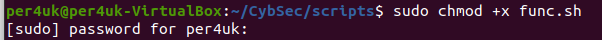
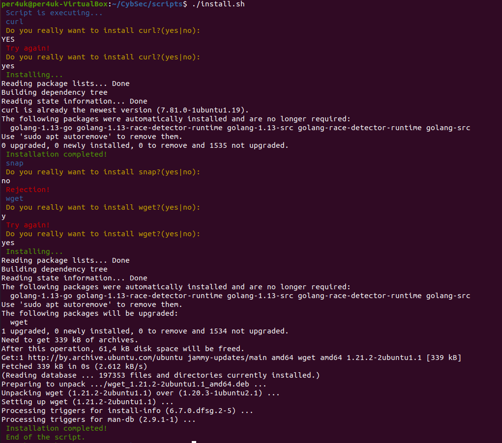
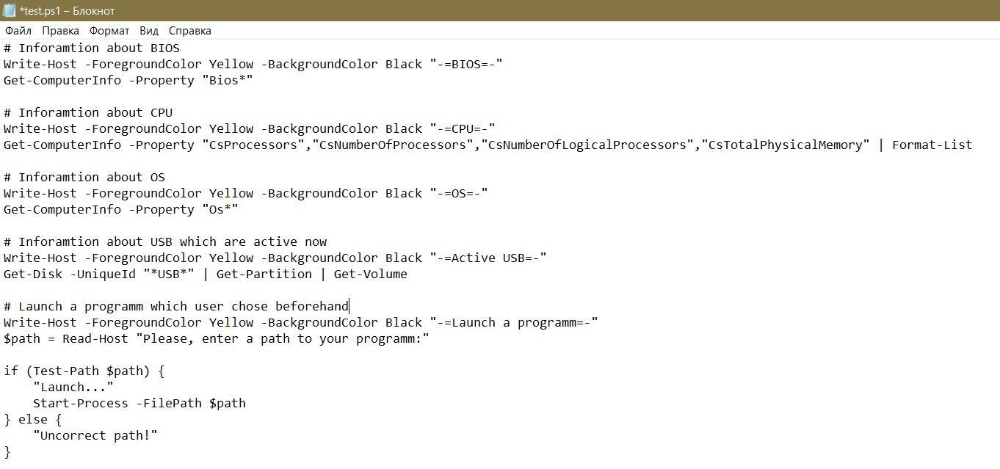
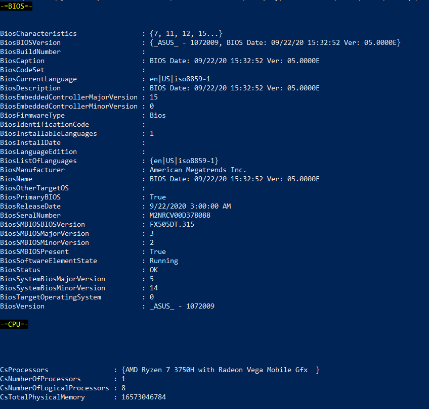
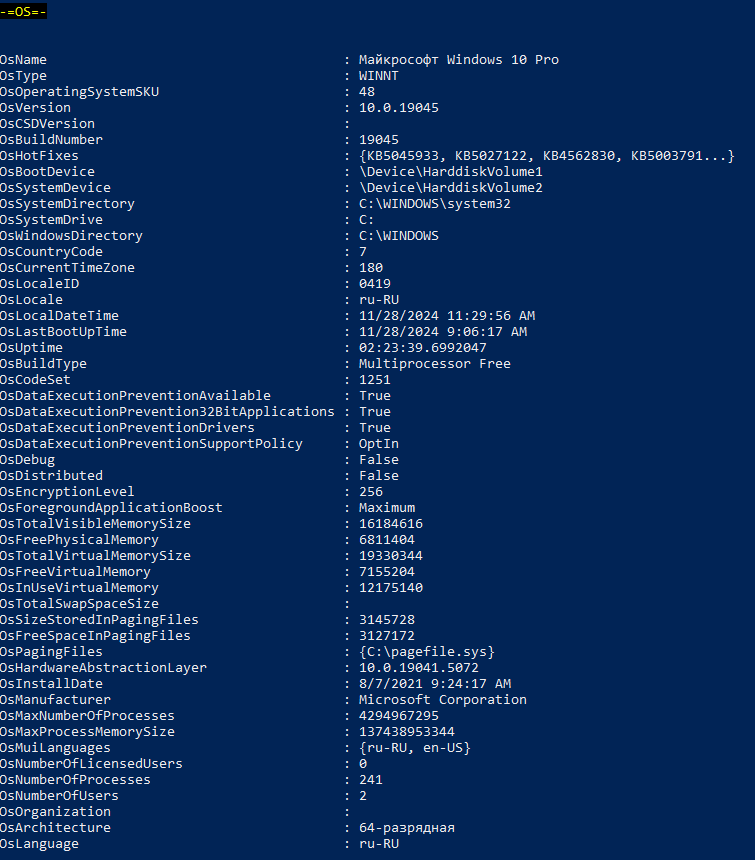
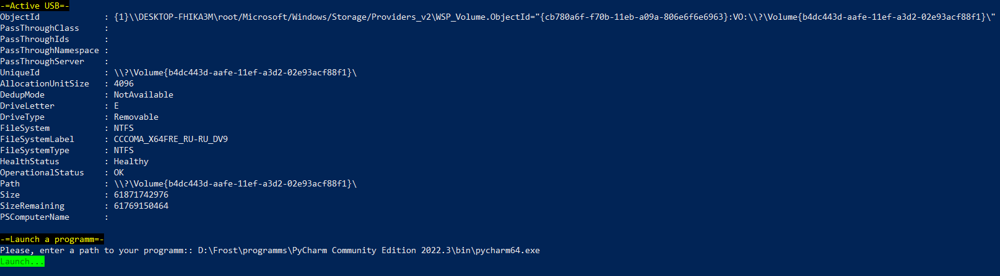
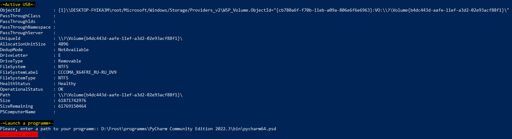

# Урок 26. Scripting  

 ## ***Домашняя работа*** ##  
1) Данный скрипт install.sh устанавливает пакеты curl, wget, snap по желанию пользователя. При этом функция установки пакета func.sh вынесена в отдельный скрипт. Ниже приведен код скриптов install.sh и func.sh:  
* install.sh  
  
  

* func.sh

  

Далее данным скриптам был добавлено разрешение на исполнение:  
* install.sh  
  
  

* func.sh

  

Результат выполнения кода приведен ниже:

  

2) Данный скрипт test.ps1 собирает информацию о БИОСе, процессоре, ОС, подключенных USB-устройств, а также запускает программуисходя из пути, введеного пользователем, при этом проверяя существование пути.
Код скрипта представлен ниже:

 

Далее запускаем скрипт из комндной строки PowerShell, при этом разрешая исполнения путем добавления специального флага:  

  

Результаты исполнения скрипта представлены ниже:  
  
  

