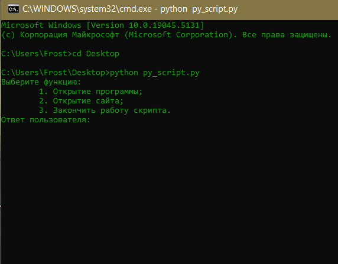
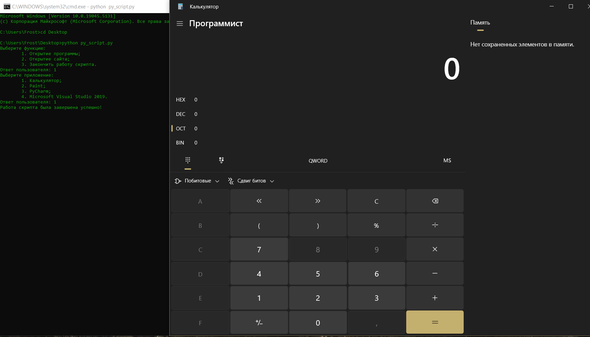
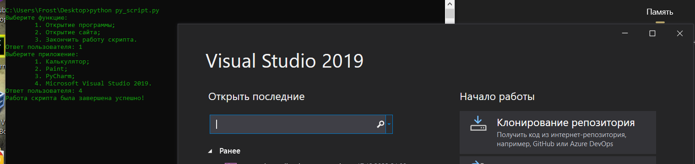
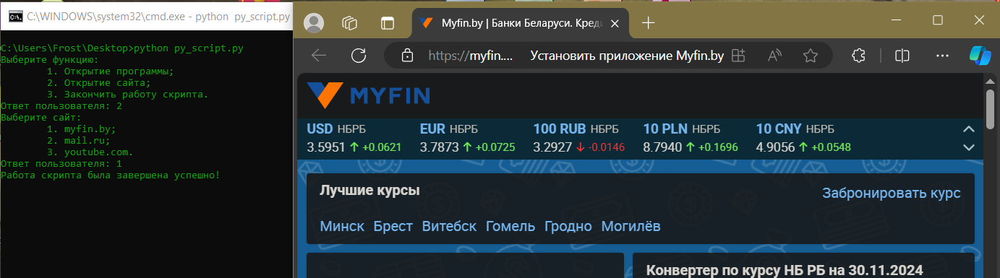

# Урок 26. Scripting, web, python  

 ## ***Домашняя работа*** ##  
1) Код скрипта на python:
```
import os
import webbrowser


def check_path(path_to_app):
    while True:
        if os.path.exists(path_to_app):
            os.system(f"start {path_to_app}")
            break
        else:
            path_to_app = str(input(
                f"{R}Заданный путь к приложению не существует. Введите новый путь!{End}:\n{G}Ответ пользователя: {End}"))

def finish_print():
    print(f"{B}Работа скрипта была завершена успешно!{End}")


R = '\033[31m'
G = '\033[32m'
B = '\033[34m'
End = '\033[0m'

option = int(input(
    f"{B}Выберите функцию:{End}\n\t1. Открытие программы;\n\t2. Открытие сайта;\n\t3. Закончить работу скрипта.\n{G}Ответ пользователя: {End}"))

if option == 1:
    application = int(input(
        f"{B}Выберите приложение:{End}\n\t1. Калькулятор;\n\t2. Paint;\n\t3. PyCharm;\n\t4. Microsoft Visual Studio 2019.\n{G}Ответ пользователя: {End}"))
    if application == 1:
        os.system("calc")
        finish_print()
    elif application == 2:
        os.system("mspaint")
        finish_print()
    elif application == 3:
        pycharm_path = r"C:\Users\Frost\Desktop\pycharm.lnk"
        check_path(pycharm_path)
        finish_print()
    elif application == 4:
        vs_path = r"C:\Users\Frost\Desktop\VS19.lnk"
        check_path(vs_path)
        finish_print()
    else:
        print(f"{R}Такого варианта ответа нет!{End}\n")

elif option == 2:
    website = int(input(
        f"{B}Выберите сайт:{End}\n\t1. myfin.by;\n\t2. mail.ru;\n\t3. youtube.com;\n\t4. Выход.\n{G}Ответ пользователя: {End}"))
    if website == 1:
        myfin_url = 'https://myfin.by'
        webbrowser.open_new(myfin_url)
        finish_print()
    elif website == 2:
        mail_url = 'https://mail.ru/'
        webbrowser.open_new(mail_url)
        finish_print()
    elif website == 3:
        youtube_url = 'https://www.youtube.com/'
        webbrowser.open_new(youtube_url)
        finish_print()
    else:
        print(f"{R}Такого варианта ответа нет!{End}\n")

elif option == 3:
    finish_print()

else:
    print(f"{R}Такого варианта ответа нет!{End}\n")
```

Примеры работы:  

  

  



  

