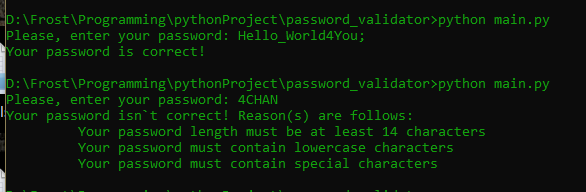

# Урок 29. Coding  

 ## ***Домашняя работа*** ##  
2) Ниже представлены скрипты проверки пароля по следующим критериям:
* Пароль должен быть длиной не менее 14 символов;
* Пароль должен содержать как строчные, так и заглавные буквы;
* Пароль должен содержать хоть один спецсимвол;
* Пароль должен содержать хоть одну цифру.
  
1) Код скрипта на python:
```
import re
import string


def is_password_correct(password):

    is_correct = True
    is_len_enough = True
    is_upper_enough = True
    is_lower_enough = True
    is_digit_enough = True
    is_spec_enough = True

    if len(password) < 14:
        is_correct = False
        is_len_enough = False

    if not re.search(r"[a-z]", password):
        is_correct = False
        is_lower_enough = False

    if not re.search(r"[A-Z]", password):
        is_correct = False
        is_upper_enough = False

    if not re.search(r"\d", password):
        is_correct = False
        is_digit_enough = False

    if not re.search(r'[^a-zA-Z0-9]', password):
        is_correct = False
        is_spec_enough = False

    return is_correct, is_len_enough, is_lower_enough, is_upper_enough, is_spec_enough, is_digit_enough


user_password = str(input("Please, enter your password: "))

if is_password_correct(user_password)[0]:
    print("Your password is correct!")
else:
    print("Your password isn`t correct! Reason(s) are follows:")
    if not is_password_correct(user_password)[1]:
        print("\t Your password length must be at least 14 characters")
    if not is_password_correct(user_password)[2]:
        print("\t Your password must contain lowercase characters")
    if not is_password_correct(user_password)[3]:
        print("\t Your password must contain uppercase characters")
    if not is_password_correct(user_password)[4]:
        print("\t Your password must contain special characters")
    if not is_password_correct(user_password)[5]:
        print("\t Your password must contain digits")
```

Примеры работы:  

  

2) Код скрипта на bash:

```
#!/bin/bash

is_len=0
is_upper=0
is_lower=0
is_spec=0
is_digit=0
R='\E[31m'
G='\033[32m'
B='\033[34m'
Y='\033[33m'
End='\033[0m'

function is_password_correct() {

        if [[ ${#1} -lt 14 ]]; then
                is_len=1
        fi

        if ! [[ $1 =~ [a-z] ]]; then
                is_lower=1
        fi

        if ! [[ $1 =~ [A-Z] ]]; then
                is_upper=1
        fi

        if ! [[ $1 =~ [0-9] ]]; then
                is_digit=1
        fi

        if ! [[ $1 =~ [^a-zA-Z0-9] ]]; then
                is_spec=1
        fi
}


read -p "Please, enter your password: " user_password
is_password_correct $user_password

if [[ $is_len -eq 0 ]] && [[ $is_lower -eq 0 ]] && [[ $is_upper -eq 0 ]] && [[ $is_spec -eq 0 ]] && [[ $is_digit -eq 0 ]]; then
        echo -e "$G Your password is correct! $End"
else
        echo -e "$R Your password is incorrect! Reason(s) are follows: $End"
        if [[ $is_len -eq 1 ]]; then
                echo -e "$Y \tYour password must be at least 14 characters! $End"
        fi
        if [[ $is_upper -eq 1 ]]; then
                echo -e "$Y \tYour password must contain uppercase characters! $End"
        fi
        if [[ $is_lower -eq 1 ]]; then
                echo -e "$Y \tYour password must contain lowercase characters! $End"
        fi
        if [[ $is_spec -eq 1 ]]; then
                echo -e "$Y \tYour password must contain special characters! $End"
        fi
        if [[ $is_digit -eq 1 ]]; then
                echo -e "$Y \tYour password must contain digits! $End"
        fi
fi
```
Примеры работы:  


