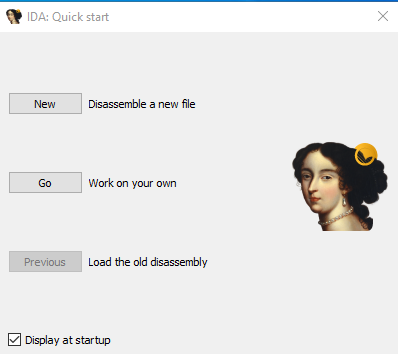
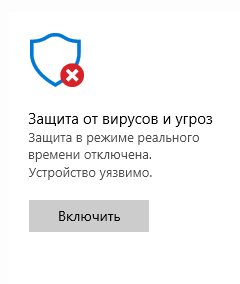
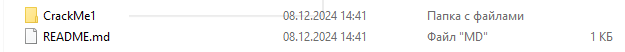
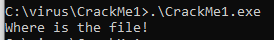
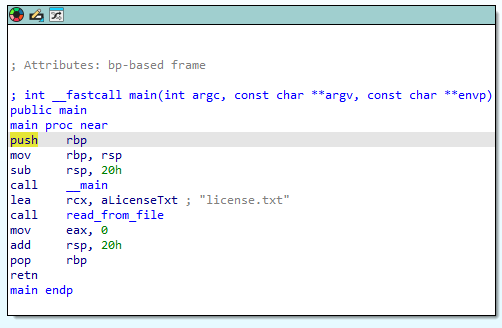
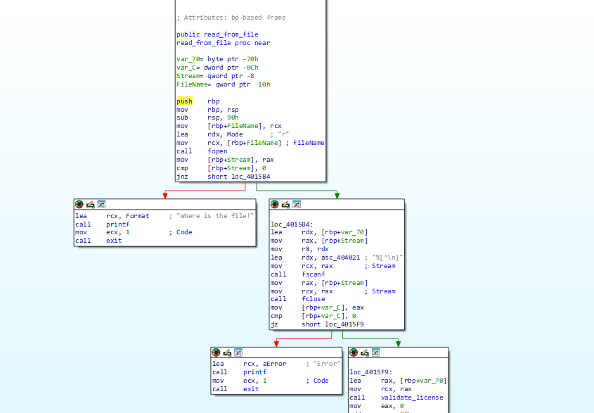
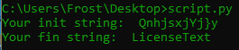
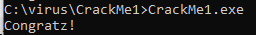

# Урок 29. Reverse engineering 

 ## ***Домашняя работа*** ##  
1) Устанавливаем Process Hacker и CrackMe.exe, IDA 8.3 уже установлена. Изучаем результат, показанный Process Hacker. Для того, чтобы скачать CrackMe.exe необходимо отключить Windows Defender.
  
  

  

  
  
  

2) Запускаем CrackMe.exe. Видим, что данный .exe требует файл. Откроем его в IDA.

  

3) C ходу в разделе с перечисленными функцию видим функцию main, которая является основной при выполнении процесса, просмотрим ее.

  

  

4) Здесь стоит обратить внимание на licence.txt в строке с операндом LEA. Далее нас интересует следующая функция read_rom_file. Открыв ее, замечаем логическое развлетвление, рассмотрим его подробней.

  

5) В первом блоке происходит откртиые потока считывания функцией fopen в строке с операндом call. Операндом MOV происходит копирование заголовка в переменную, которая далее сранивается операндом CMP. В общем, происходит поиск файла с конкретным названием. В случае FALSE происходит вывод "WHERE is the file!", которое мы наблюдали при запуске .exe. В противном случае
происходит работа по считыванию содержимого файла функцией fscanf в переменную, после чего поток чтения закрывает функция fclose. Файл проверяется на наличие специальных символов "%[^\n]", которые будут выдавать ошибку. В случае FALSE, выводится "ERROR!", в противном случае - вызывается функция validate_licence,а после read_from_file заканчивает работу. Переходим к функции read_from_file. Она слишком большая, поэтому ее не привожу. В таких случаях открываем код и анализируем его. Из него видно, что на вход функции поступает один параметр a1, который представляет собой содержимое файла. Далее видим структуру if-else, в которой сранвивается длина данной строки с 23: если FALSE, выдается ошибка, если TRUE, алгоритм идет дальше.
```
v3 = strlen(a1);
  v11 = 0;
  if ( strlen(a1) != 23 )
  {
    printf("The license key is not correct.");
    exit(1);
  }
```
6) Далее просиходит проверка первых шести байт содержимого файла со строкой v5 = "#BEGIN#":
```
for ( i = 0; i <= 6; ++i )
  {
    if ( v5[i] != a1[i] )
    {
      printf("The license key is not correct.");
      exit(1);
    }
  }
```
7) Далее происходит работа с переменной v5, равной "QnhjsxjYj}y". C ней выполянется структура for, в которой каждому символу переприсваивается значение на 5 меньше по ASCII-коду. Для того, чтобы выяснить результат, напишем скрипт и запустим:
```
init_string = "QnhjsxjYj}y"
print("Your init string: ", init_string)
fin_string = ''.join(chr(ord(char) - 5) for char in init_string)
print("Your fin string: ", fin_string)
```

  

8) Как результат, у нас получается строка LicenceText. По аналогии с v5, происходит сравнения последних 5 байт со строкой v4 = "#END#", в случает успеха у нас выводится "Congratz!", в противном случае "The license key is not correct.". Проверяем все вышенаписанное, создаем файл "license.txt", помещая в него итоговую строку "#BEGIN#LicenceText#END#".

  

Стоит оговорится, что у меня есть опыт работы с IDA, поэтому она имеется у меня. Данная работа была проведена самостоятельно с использованием справочника по операндам асемблера и знания низкоуровневых ЯП с и с++.


