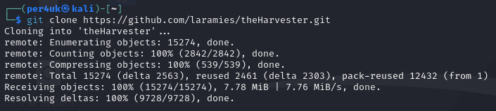
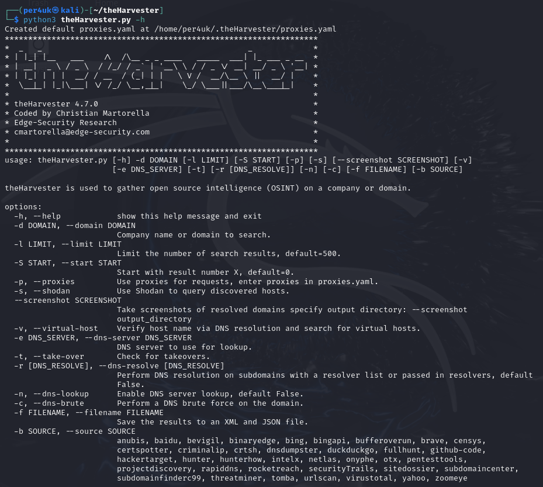
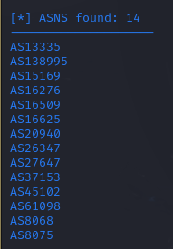
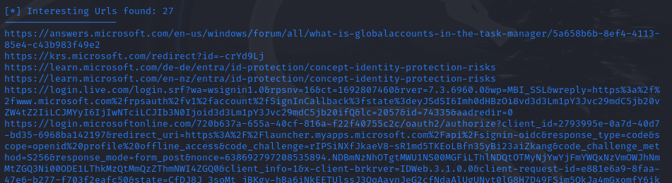
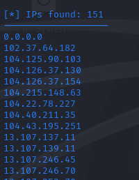
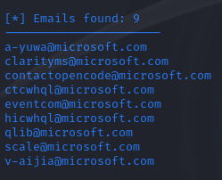
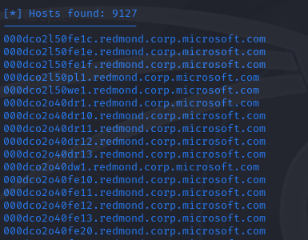

# Урок 34. OSINT

 ## ***Домашняя работа*** ##  
1) Устанавливаем TheHarvester.
  
  

2) Проверяем TheHarverster.  

  

3) Запусккаем TheHarvester, вводя команду:  
```
sudo theHarvester -d microsoft.com -b all -l 200
```
C помощью которой выведется информация по домену microsoft.com всеми источниками (Bing, Yahoo и т.д.) с ограничением до 200 записей. Результаты следующие:  

  

  

  

  




