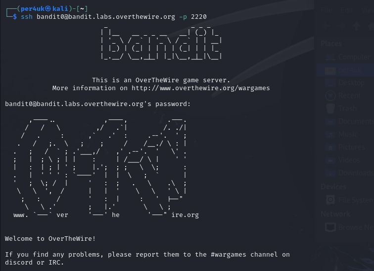

# Урок 37. CTF

 ## ***Домашняя работа*** ##  
1) На данном этапе я зарегистрировался на сайте CODEBY, прошел обучение во всех категориях. Также прошел 12 уровней в BANDIT. 

  

Ниже приведены флаги:  

|Задание|Значение флага|
|-|----|
|Task_0|bandit0|
|Task_1|ZjLjTmM6FvvyRnrb2rfNWOZOTa6ip5If|
|Task_2|263JGJPfgU6LtdEvgfWU1XP5yac29mFx|
|Task_3|MNk8KNH3Usiio41PRUEoDFPqfxLPlSmx|
|Task_4|2WmrDFRmJIq3IPxneAaMGhap0pFhF3NJ|
|Task_5|4oQYVPkxZOOEOO5pTW81FB8j8lxXGUQw|
|Task_6|HWasnPhtq9AVKe0dmk45nxy20cvUa6EG|
|Task_7|morbNTDkSW6jIlUc0ymOdMaLnOlFVAaj|
|Task_8|dfwvzFQi4mU0wfNbFOe9RoWskMLg7eEc|
|Task_9|4CKMh1JI91bUIZZPXDqGanal4xvAg0JM|
|Task_10|FGUW5ilLVJrxX9kMYMmlN4MgbpfMiqey|
|Task_11|dtR173fZKb0RRsDFSGsg2RWnpNVj3qRr|
|Task_12|7x16WNeHIi5YkIhWsfFIqoognUTyj9Q4|

  

