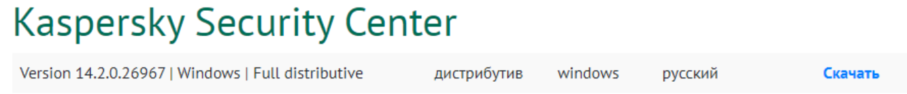

# Урок 38. Рынок Кибербеза 

 ## ***Домашняя работа*** ##  
1) Заходим на официальный сайт вендора и загружаем инсталлер на Windows Server.
    
  

Запускаем:  

  

Перед установкой необходимо установить сервер базы данных, в котором будут храниться данные. В процессе программы будут предложены варианты MySQL, Microsoft SQL Server, PostgreSQL. Я выбрал Microsoft SQL.  
  
  
  
Также тут я выбрал Express, поскольку Developer обладает большим количеством инструментов и предназначен для полного управления БД, а Express является базовой версией, имеющей минимальный набор инструментов для решения самых тривиальных задач. Запускаю инсталлер. 

  

Далее следую пунктам установки. Посел успешной установки Microsoft SQL Server приступаем к установке KSC:  

  

  

  

  

  

  

  

  

  

После установки запускаем KSC:  

 

