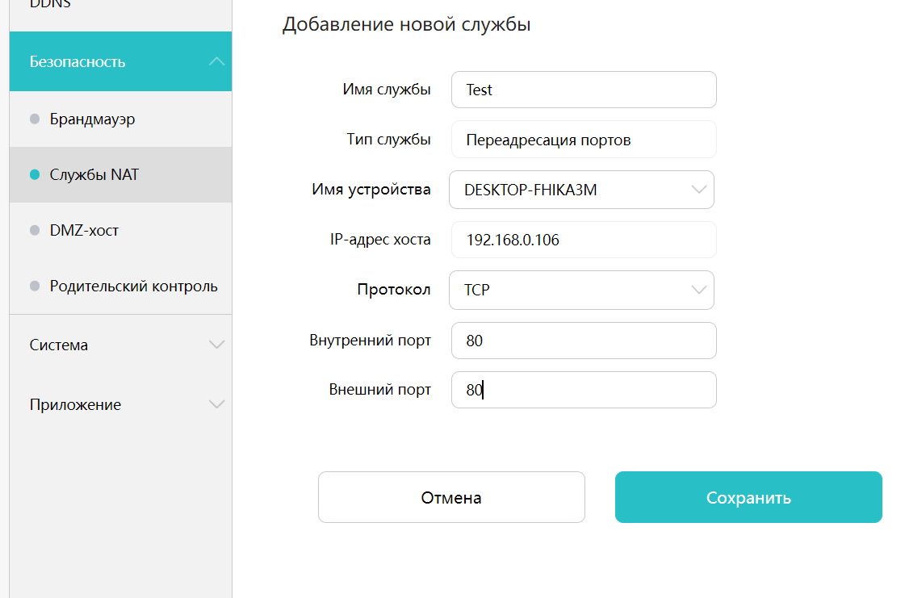

# Урок 5. Компьютерные сети.

### ***Сетевой пакет*** ###
Единица данных, передаваемая по сети в пакетном режиме, состоит из заголовка и данных.

### ***Заголовок*** ###
Часть пакета, необходимая для маршрутизации пакета к получателю.

### ***MTU (Maximum transmit unit)*** ###
Максимальный размер пакета данных, который может быть передан без фрагментации.

### ***Фрагментация*** ###
Процесс разделения пакета на более мелкие части, чтобы он мог пройти через сетевой интерфе  с с ментшим MTU.

### ***Сетевые схемы*** ###
Бывают физическая и логическая. Логическая является более подробным описанием структуры сети, включает в себя такие настройки как IP, шлюз и т.д

### ***Топологии*** ###
1. Полносвязные.
2. Звезда.
3. Общая шина.
4. Кольцо.

### ***! Прокси + шифрование = VPN*** ###

### ***Стандартные порты*** ###
1. HTTP: 80 (8080)
2. HTTPS: 443
3. FTP: 21
4. SSH: 22
5. DNS: 53
6. RDP: 3389

## ***Домашняя работа*** ##
1. Изучил настройки своего роутера. Скрин настройки проброса портов.
     
  
2. Базовая схема с различными сетевыми элементами.  

  

В качетсве доказательства факта работы сети прилагаю ping, выполненную с узла 192.168.0.8 на узел 192.168.20.2.  

  

Далее был добавлен в сеть сервер, на нем настроена страница mysite, а также dns. Данная страница была открыта через web-browser с того же самого узла 192.168.0.8.

  

