# Урок 6. Криптография.

### ***Шифр*** ###
Метод преобразования данных таким образом, чтобы они были нечитаемы для всех, кроме тех, кто имеет ключ для дешифрования. Бывают симметричные (блочные, поточные) и ассиметричные.

### ***АШ*** ###
Математический метод реализации шифра.

### ***Ключ*** ###
Секретная информация для шифрования/дешифрования данных.

### ***Криптостойкость*** ###
Способность шифра противостоять атакам, направленных на его взлом.

### ***Алгоритм Диффи-Хелмана*** ###
Алгоритм, предназначеный для обмена публичных ключей, на основании которых высчитываются приватные.  \
  
Пример создания секретного ключа:  

Допустим, Алиса и Боб хотят создать общий секретный ключ, используя алгоритм Диффи-Хеллмана. Они выполняют следующие шаги:  
Алиса и Боб выбирают общие параметры: основание g (допустим, 5) и большое простое число p (допустим, 23).  
  
Алиса генерирует свой секретный ключ a (допустим, 6) и вычисляет свой публичный ключ A:   
A = g^a mod p = 5^6 mod 23 = 15625 mod 23 = 8.  
  
Боб генерирует свой секретный ключ b (допустим, 9) и вычисляет свой публичный ключ B:   
B = g^b mod p = 5^9 mod 23 = 1953125 mod 23 = 11.  
  
Алиса и Боб обмениваются публичными ключами: Алиса отправляет свой ключ A (8) Бобу, а Боб отправляет свой ключ B (11) Алисе.  
Алиса вычисляет общий секретный ключ s:   
s = B^a mod p = 11^6 mod 23 = 1771561 mod 23 = 9.  
  
Боб вычисляет общий секретный ключ s:  
s = A^b mod p = 8^9 mod 23 = 134217728 mod 23 = 9.  
  
Теперь Алиса и Боб имеют общий секретный ключ s, который равен 9. Этот ключ может быть использован для дальнейшего зашифрования и расшифрования сообщений между ними.

### ***Хеширование*** ###
Предназначено для создание уникального индификатора для данных. В отличие от штфрования является необратимым процессом. Чем больше блок хеша, тем меньше вероятность появления коллизий. Представители: MD5, SHA-1, SHA-256, SHA-512.

## ***Домашняя работа*** ##
# 1.1. IKE Phase 1 #  
Основная цель фазы 1 IKE — создание безопасного туннеля, который мы можем использовать для фазы 2 IKE.  

Фазу 1 можно разбить на три простых шага:  
  
Шаг 1: Переговоры  
Узел, трафик которого должен быть защищен, инициирует согласование фазы IKE 1. Два узла будут договариваться о следующих пунктах:  

- Хеширование : для проверки целостности мы используем алгоритм хеширования, для этого мы используем MD5 или SHA.  
- Аутентификация : каждый пир должен доказать, кто он есть. Два наиболее часто используемых варианта — это предварительный общий ключ или цифровые сертификаты.
- Группа DH (Diffie Hellman) : группа DH определяет силу ключа, используемого в процессе обмена ключами. Более высокие номера групп более безопасны, но требуют больше времени для вычисления.  
- Срок службы : как долго туннель фазы 1 IKE выдерживает? Чем короче срок службы, тем он безопаснее, поскольку его перестройка означает, что мы также будем использовать новый ключевой материал. Каждый поставщик использует разное время жизни, общее значение по умолчанию составляет 86400 секунд (1 день).  
- Шифрование : какой алгоритм мы используем для шифрования? Например, DES, 3DES или AES.  
  
Шаг 2: Обмен ключами DH  
После успешного согласования два пира будут знать, какую политику использовать. Теперь они будут использовать группу DH, о которой договорились, для обмена ключевым материалом. Конечным результатом будет то, что оба пира будут иметь общий ключ.  
  
Шаг 3: Аутентификация  
Последний шаг заключается в том, что два пира будут аутентифицировать друг друга, используя метод аутентификации, который они согласовали в ходе переговоров. Если аутентификация прошла успешно, мы завершили фазу 1 IKE. Конечным результатом является туннель фазы 1 IKE (он же туннель ISAKMP), который является двунаправленным. Это означает, что оба пира могут отправлять и получать данные по этому туннелю.  
  
Три вышеуказанных шага можно выполнить, используя два различных режима: 

Основной режим;  
Агрессивный режим.  

Основной режим использует шесть сообщений, а агрессивный режим использует только три сообщения. Основной режим считается более безопасным. 

# 1.2. IKE Phase 2. #  
Туннель IKE фазы 2 (туннель IPsec) будет фактически использоваться для защиты пользовательских данных. Существует только один режим для построения туннеля IKE фазы 2, который называется быстрым режимом .  

Как и на первом этапе IKE, наши коллеги будут вести переговоры по ряду вопросов:  
- Протокол IPsec : какой протокол мы используем — AH или ESP?
- Режим инкапсуляции : транспортный или туннельный режим?
- Шифрование : какой алгоритм шифрования мы используем? DES, 3DES или AES?
- Аутентификация : какой алгоритм аутентификации мы используем? MD5 или SHA?
Lifetime : как долго действует туннель IKE phase 2? Когда срок действия туннеля подходит к концу, мы обновим ключевой материал.
- (Необязательно) Обмен DH : используется для PFS (совершенная прямая секретность).
PFS является необязательным и заставляет одноранговые узлы снова запускать обмен DH для генерации нового общего ключа в каждом быстром режиме фазы 2 IKE.  

# 1.3. IPSEC. #  
IPsec (Internet Protocol Security) — это фреймворк, который помогает нам защищать IP-трафик на сетевом уровне. Почему? Потому что сам IP-протокол не имеет никаких функций безопасности вообще. IPsec может защитить наш трафик с помощью следующих функций:  

- Конфиденциальность : благодаря шифрованию наших данных никто, кроме отправителя и получателя, не сможет прочитать наши данные.  
- Целостность : мы хотим быть уверены, что никто не изменяет данные в наших пакетах. Вычисляя значение хэша, отправитель и получатель смогут проверить, были ли внесены изменения в пакет.  
- Аутентификация : отправитель и получатель аутентифицируют друг друга, чтобы убедиться, что мы действительно общаемся с тем устройством, с которым намереваемся связаться.  
- Anti-replay : даже если пакет зашифрован и аутентифицирован, злоумышленник может попытаться перехватить эти пакеты и отправить их снова. Используя порядковые номера, IPsec не будет передавать дубликаты пакетов.
  
# 1.4. HTTP vs HTTPS. #  
Протокол передачи гипертекста (HTTP) – это протокол или набор правил взаимодействия между клиентом и сервером. Когда вы посещаете веб-сайт, ваш браузер отправляет HTTP-запрос на веб-сервер, который отправляет HTTP-ответ. Веб-сервер и ваш браузер обмениваются данными в виде обычного текста. Вкратце, протокол HTTP – это базовая технология, обеспечивающая сетевую связь. Как следует из названия, защищенный протокол передачи гипертекста (HTTPS) является более безопасной версией или расширением HTTP. При использовании HTTPS браузер и сервер устанавливают безопасное зашифрованное соединение перед передачей данных.  

Зачем выбирать HTTPS вместо HTTP?  
Далее мы обсудим некоторые преимущества HTTPS перед HTTP.  
  
Безопасность  
HTTP-сообщения представляют собой обычный текст, поэтому неавторизованные лица могут легко получить к ним доступ и прочитать их через Интернет. Напротив, HTTPS передает все данные в зашифрованном виде. Когда пользователи отправляют конфиденциальные данные, они могут быть уверены, что никакие третьи стороны не смогут их перехватить по сети. Для защиты потенциально конфиденциальной информации, например данных кредитной карты или личных данных клиентов лучше выбрать HTTPS.  
  
Сертификационный орган  
Поисковые системы обычно оценивают содержимое веб-сайтов HTTP ниже, чем веб-страницы HTTPS, потому что HTTP менее заслуживает доверия. Клиенты также предпочитают веб-сайты HTTPS, а не HTTP. Браузер обозначает HTTPS-подключение, поместив значок замка в адресной строке браузера рядом с URL-адресом веб-сайта. Пользователи предпочитают веб-сайты и приложения HTTPS благодаря этим дополнительным факторам безопасности и доверия.  
  
Производительность и аналитика  
Веб-приложения HTTPS загружаются быстрее, чем HTTP-приложения. Также HTTPS также лучше отслеживает реферальные ссылки. Реферальный трафик – это трафик на ваш сайт из сторонних источников, таких как реклама или обратные ссылки в социальных сетях. Вы должны включить HTTPS, если хотите, чтобы аналитическое программное обеспечение точно определяло ваши надежные источники трафика.  

# 2. Подключение к ВМ Window 10 из ВМ Ubuntu 20 #  
1. Установка ssh-server на ВМ Ubuntu 20 командой sudo apt install ssh-server.  
2. Проверка запуска службы ssh командой sudo systemctl status ssh.
      
   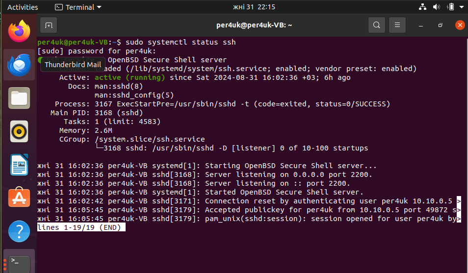
   
3. Создание ключей my_key и my_key.pub командой ssh-keygen -t ed25519. В директории ~/.ssh/ появились ключи.  
   
   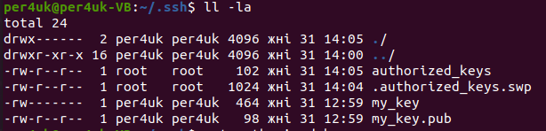  
  
4. На ВМ Window 10 переносим публичный ключ и записываем в файл: C:/Users/user/.ssh/authorized_keys.  
  
   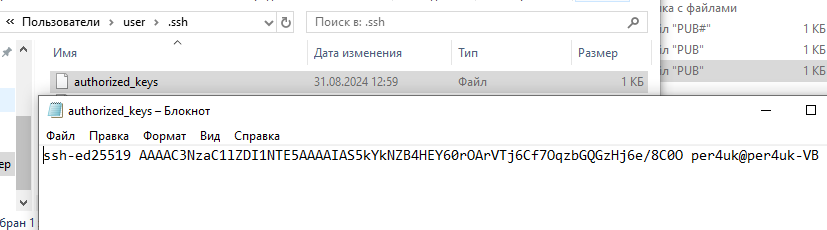  
  
5. Подключение к ВМ Window 10 из ВМ Ubuntu 20 по ssh :  
  
   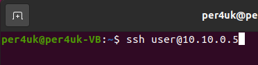
       
7. Выполнение команды dir из терминала Ubuntu 20.  
  
   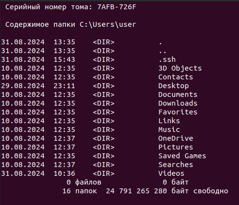  
  
# 3. Подключение к ВМ Ubuntu 20 из Window 10 #  
1. Стоит отметить, что последовательность действий является аналогичной. Результат:  
  
   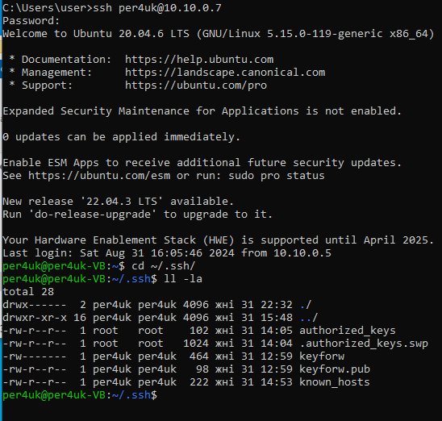  
  
Но в данном примере настройка проведена по правилам BestPractice из статьи.  
2. Редактирвоание файла /etc/ssh/ssh_config. Были изменены строки:  HostbasedAuthentication no, PermitRootLogin no, Port 2200, PermitEmptyPasswords no, IgnoreRhosts yes.  
  
   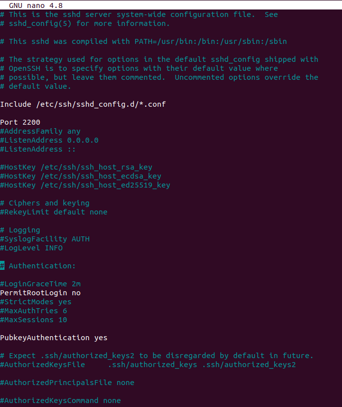  
  
3. Подключение к ВМ Ubuntu 20 из Window 10 согласно правилам BestPractice.  
  
   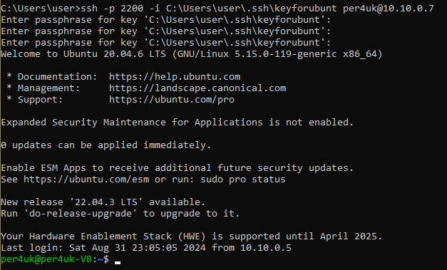

# 4. WireGuard VPN #  

1. Обновление Ubuntu 20  командами sudo apt update, sudo apt upgrade, скачивание WireGuard.

   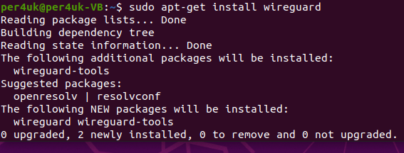

2. Установка скрипта с настройками WireGuard с Git, делая его исполняемым.

   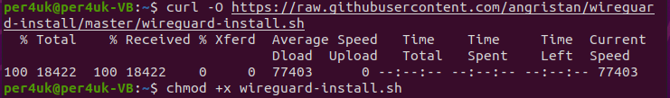

3. Запуск скрипта через консоль и добавление необходимых параметров для настройки.

  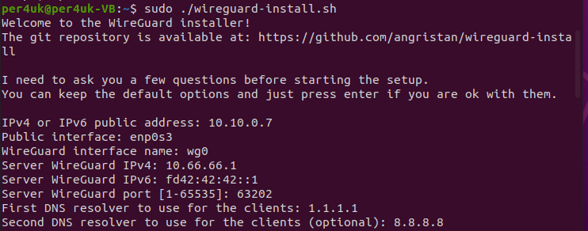  

4. По окончании в консоли высветится QR-code. Также в папке /home/$user$ появится конфигурационный файл с публичным ключом, который необходимо передать на Windows 10 (на скриншоте файл выделен).

    

    

  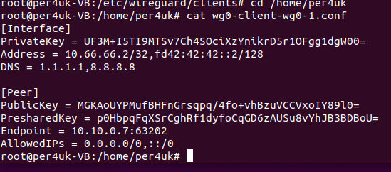

5. Далее работаем с Windows 10. Устанавливаем WireGuard, далее через кнопку "Создать туннель" появится диалоговое окно, в котором необходимо указать конфигурационный файл. Далее устанавливаем подключение через кнопку "Подключить".

  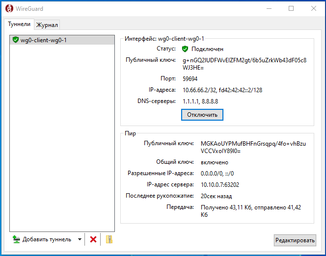 

