# Урок 17. Защита инфраструктуры приложений  

 ## ***Домашняя работа*** ##  
1) Установка docker командой sudo apt intall docker и проверка работоспособности.    
  
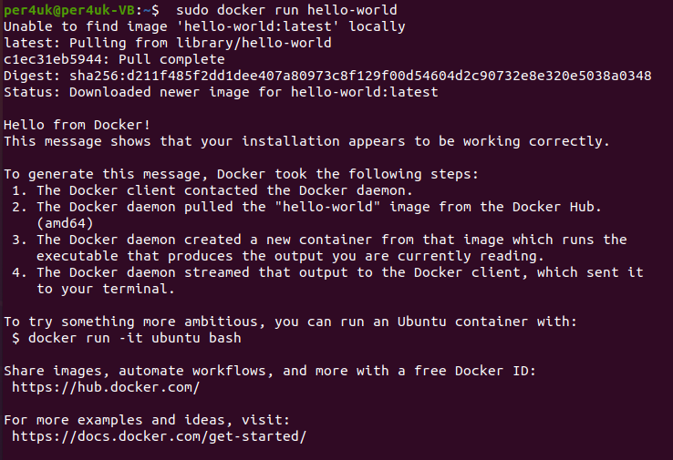  

Установка Ubuntu и проверка контрольной суммы скаченной и эталонной версии:  
  
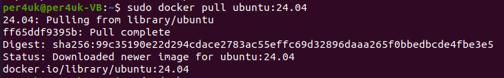  
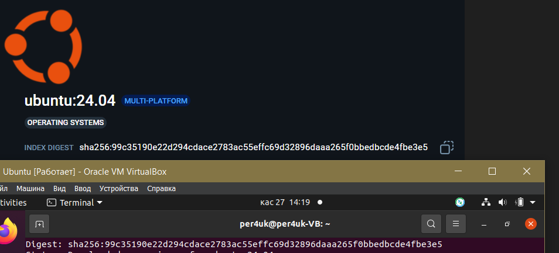  

Просмотр всех установленных образов:  

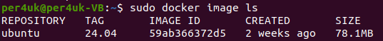 

Добавление пользователя в группу docker для запуска без sudo  и результат:  

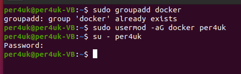  
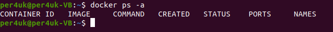  

Вход в контейнер и результат вывода команды whoami:  

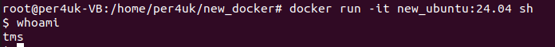  

Для добавления нового пользователя в контейнер необходимо написать Dockerfile, который будет брать за основу текущее изображение и добавить в него пользователя. Файл
, построение образа и результат команды whoami внутри контейнера приведен ниже:

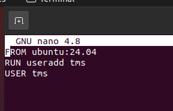  
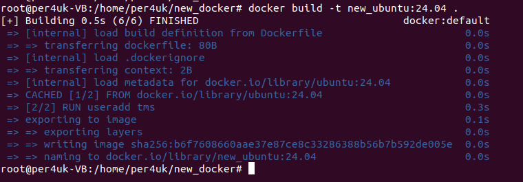  
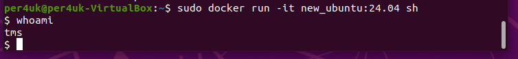  

Сканирование контейнера с помощью trivy:  

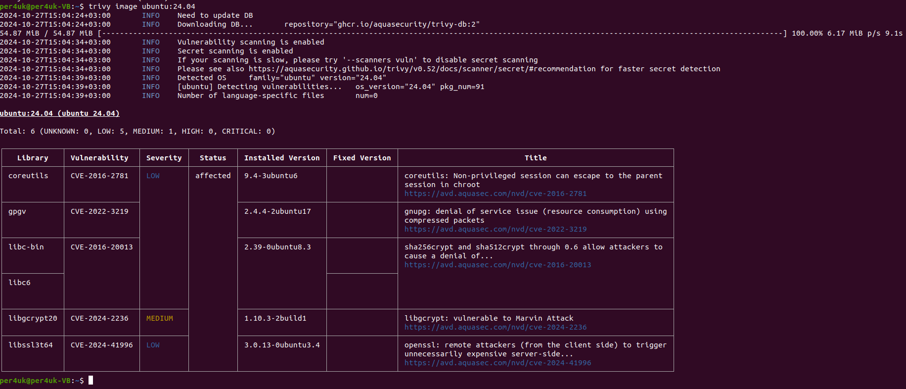  

По результатам сканирование видны 6 узвимостей, из которых 5 низкого уровня и 1 среднего. В таблице приведены их названия, классификация и описание.

