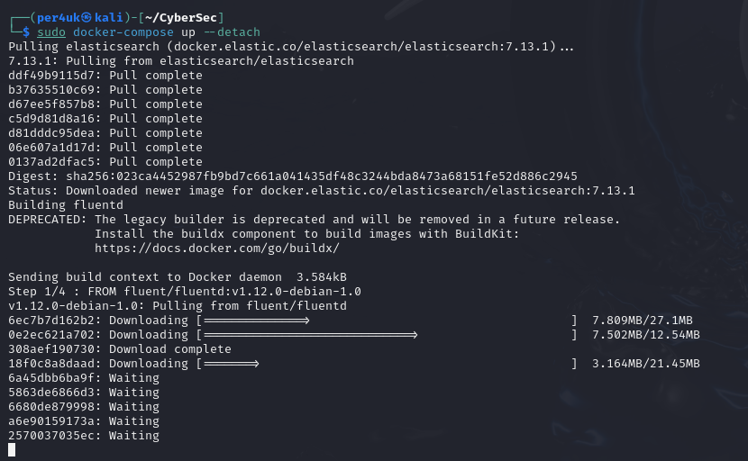
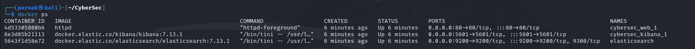
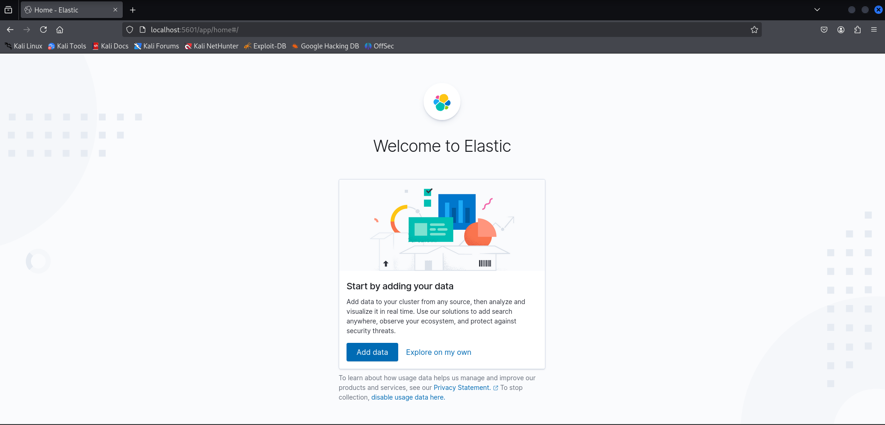
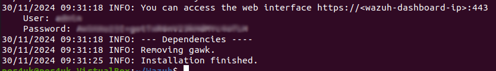
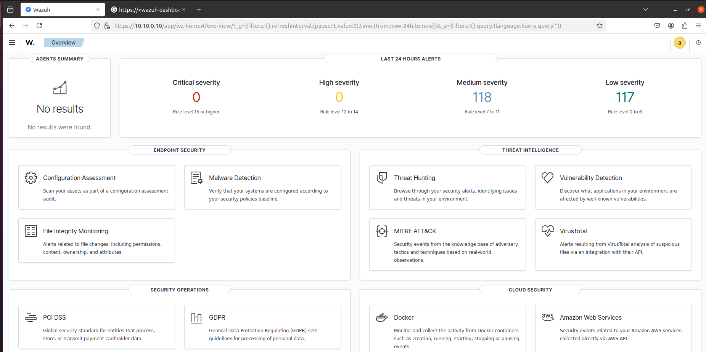

# Урок 23. Event Management  

 ## ***Домашняя работа*** ##  
1) Для установки использовался справочный матриал ["Установка EFK"](https://docs.fluentd.org/container-deployment/docker-compose).
Создаем папку с Dockerfile, в который помещаем код для устноавки контейнера:
```
# fluentd/Dockerfile

FROM fluent/fluentd:v1.12.0-debian-1.0
USER root
RUN ["gem", "install", "fluent-plugin-elasticsearch", "--no-document", "--version", "5.0.3"]
USER fluent
```
Далее создаем fluentd/conf/fluent.conf, который представляет собой файл конфигураций.  
```
# fluentd/conf/fluent.conf

<source>
  @type forward
  port 24224
  bind 0.0.0.0
</source>

<match *.**>
  @type copy

  <store>
    @type elasticsearch
    host elasticsearch
    port 9200
    logstash_format true
    logstash_prefix fluentd
    logstash_dateformat %Y%m%d
    include_tag_key true
    type_name access_log
    tag_key @log_name
    flush_interval 1s
  </store>

  <store>
    @type stdout
  </store>
</match>
```
Запускаеи контейнер:  

 

Проверяем запущенные контейнеры:  

  

Переходим в браузер, в данном случае Mozila,и открываем стартовую страницу:  



2) Для установки WAZUH необходимо воспользоваться следующей командой:

  

Стоит отметить, что данная установка является продолжительной. По окончании нам будет доступен логин и пароль для входа в браузере.  
  
  

Далее в адресной строке вводим свой IP-адрес, вводим учетные данные: 

  


  


