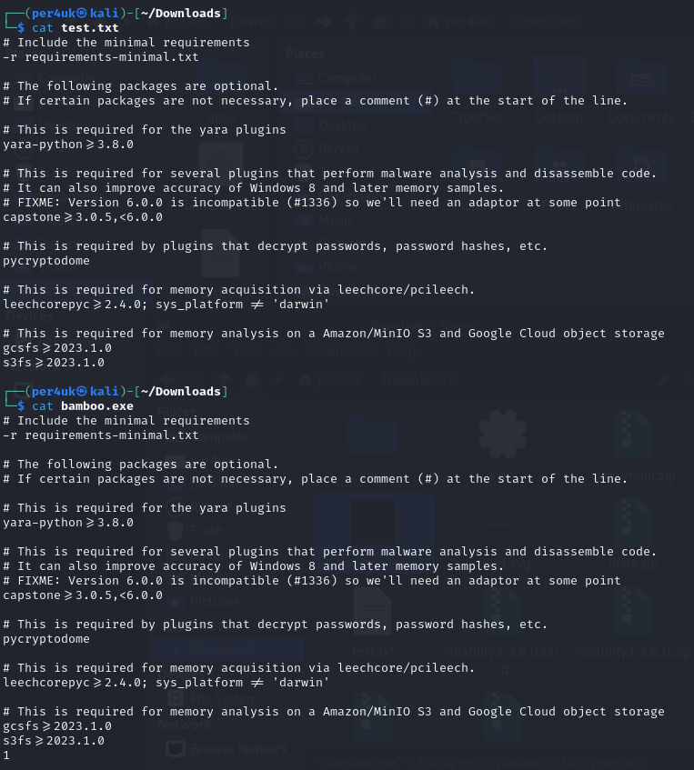
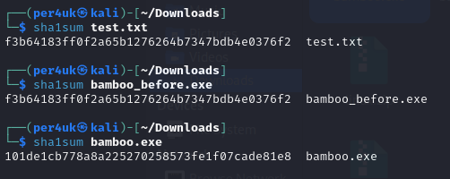
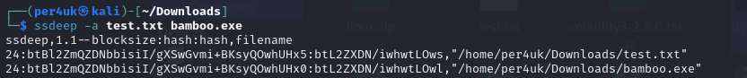
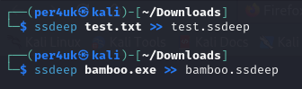
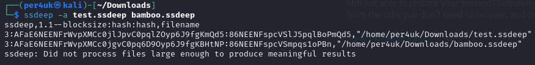

# Урок 28. Coding  

 ## ***Домашняя работа*** ##  
1) Устанавливаем ssdeep "командой sudo apt install ssdeep", далее создаем файлы test.txt и bamboo.exe по заданным условия:

  
Далее вычисляем хешы файлов: test.txt, bamboo.exe до и после добавления 1 в конец файла:  

Далее сравниваеи файлы с помощью ssdeep:

  

Также для сравнения файлов можн опоступить по другому путем создания промежуточных файлов:  

  

