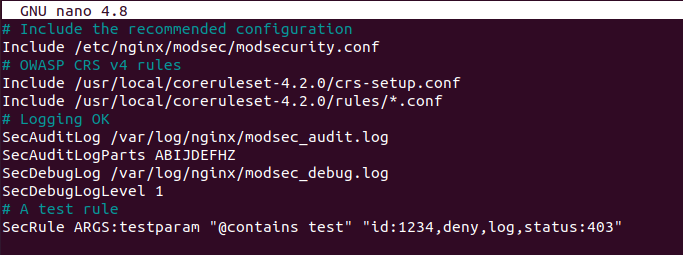
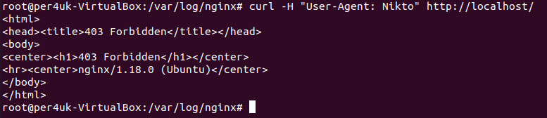

# Урок 30. Web Application Security 

 ## ***Домашняя работа*** ##  
1) Установка WAF (nginx + Modsecurity) производилась долго и кропотливо в результате разбора нескольких статей в соответсвии со следующими пунктами:  
   * Установка дополнительных зависемостей и  Nginx;  
   * Установка ModSecurity путем клонирования директории из github и дальнейшая ее компиляция с помощью скрипта build.sh, ./configure и системы сборки make;  
   * Далее установился коннектор Nginx и ModSecurity с помощью пакетного менеджера wget, при этом внимание уделялось версии скаченного Nginx (nginx -V);  
   * Компиляция Nginx c помощью ./configure;  
   * Далее компиляция модулей с помощью системы сбрки make и копирование их в директорию с Nginx;  
   * Конфигурация правил ModSecurity с OWASP CRS путем скачивания;  
   * Далее добавление в modsecurity.conf SecRuleEngine On, который запускает работы ModSecurity, а не запускает только обнаружение в отличие от SecRuleEngine DetectionOnly и перемещеие данного файла в /etc/nginx/modsec/;  
   * Добавление в /etc/nginx/modsec/main.conf файлов-конфигураций ModSecurity и coreruleset. При этом были добавлены строки для логирования.  
     

   * Добавление в /etc/nginx/nginx.conf в server правила для ModSecurity, указывающие на его запуск, а также дополнительные конфигурации и правила. При этом в моем случае сервер не запускался без следующей строки:
     ```
      load_module /usr/share/nginx/modules/ngx_http_modsecurity_module.so;
     ```
   * Установка файла конфигурации crs-setup.conf и его перемещние;
   * Проверка работы Nginx:
     ```
      sudo nginx -t
     ```
   * Перезапуск:
     ```
      sudo systemctl restart nginx
     ```
   * Проверка реакции на curl-запрос:    
     

     Подытоживаю результат, исходя из правила, указанного в main.conf, результатомявляется ошибка 403 (Forbidden), что означает запрещение данного запроса. Таким образом, WAF работает.


