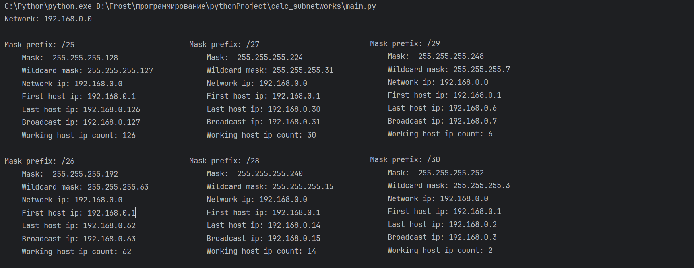
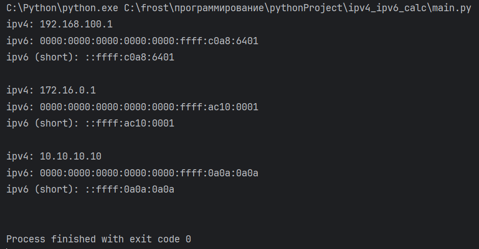

# Урок 4. Основы сетей.

### ***Хост*** ###
Любое устройство, которое подключено к сети и имеет уникальный адрес.

### ***Конечный хост*** ###
Хост, являющийся конечной точкой сети.

### ***Модель OSI*** ###
Стандартная модель взаимодейтсвия открытых систем, описывающая, как устройства в локальной и глобальной сети обмениваются данными и что происходит с этими данными.

### ***Сетевой протокол*** ###
Набор правил обмена данными на конкретном урвоне модели OSI.

### ***Стандартные порты*** ###
1. HTTP: 80 (8080)
2. HTTPS: 443
3. FTP:21
4. SSH:22
5. DNS:23
6. RDP:3389

## ***Домашнее задание*** ##
 ### 1. Модель OSI. ###
|Уровень|Протоколы|PDU|Атаки на уровень|
|---|---|---|---|
|Прикладной (application)|HTML, HTTP, HTTPS, POP|Данные|Эксплойт|
|Представления (presentation)|JPEG, MPEG, ASCII, ANSI|Данные|Фишинг|
|Сеансовый (session)|SMPP, ASP, L2F, SCP|Данные|Перехват файлов cookie для получения несанкционированного доступа|
|Транспортный (transport)|UDP, TCP, PRD|Датаграмма|Разведка структуры сети посредством сканирования портов ПО Nmap|
|Сетевой (Network)|ICMP, NAT, RIP, IPv4/v6, IPSec|Пакет|DOS, DDOS, IP-spoofing|
|Канальный (Data link)|MAC/LLC, HDLC, Token Ring|Кадр|MAC/ARP-spoofing|
|Физический (Physic)|RS-232, RJ-11 (телефонный),RJ-45 (витая пара), USB, Wi-Fi, Bluetooth, Ethernet|Кадр|Sniffing с помощью сторонних ПО (Wireshark, TCPDump)|    

2. Описание подсетей.

       
3. Конвертация IPv4 в IPv6.

    

