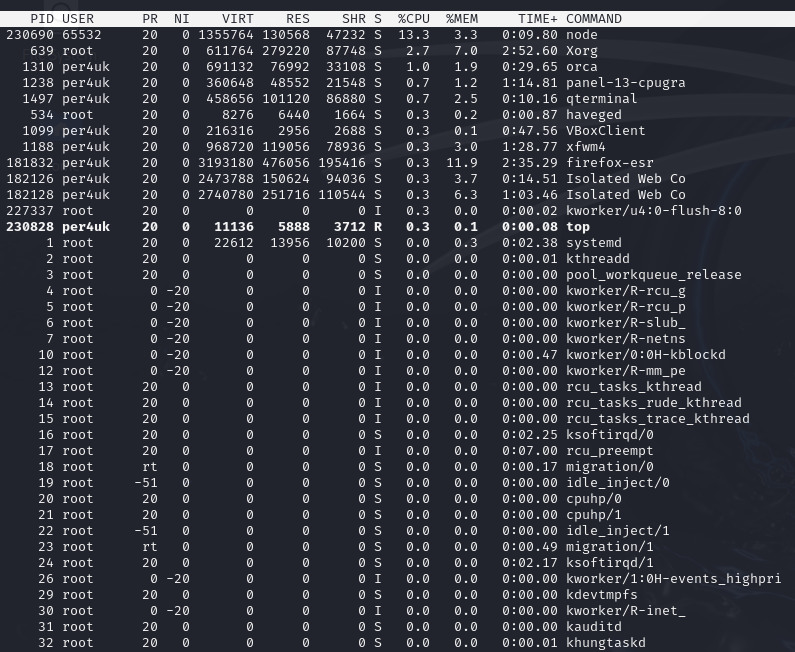
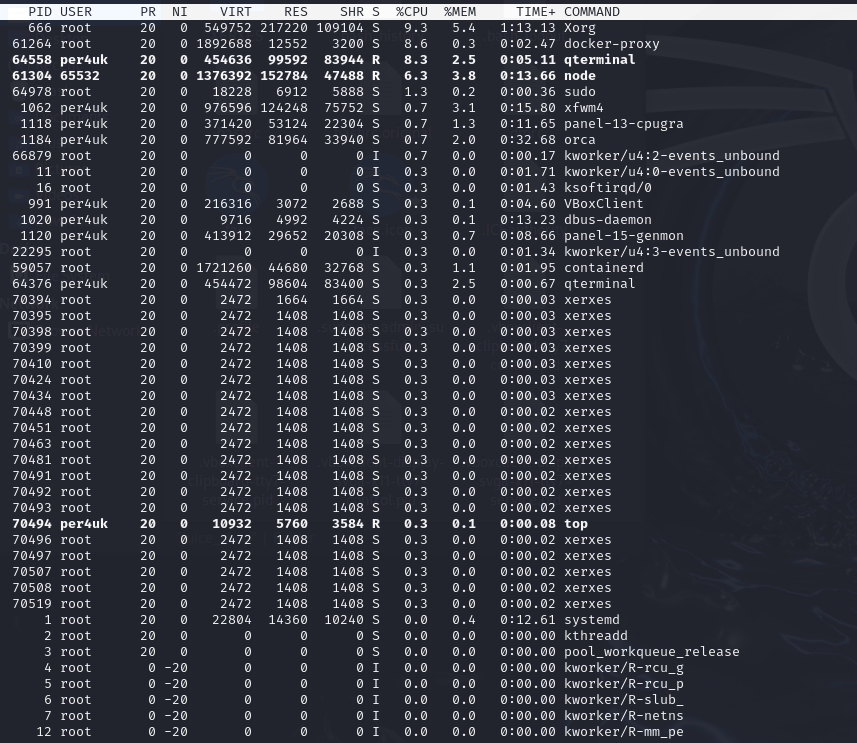
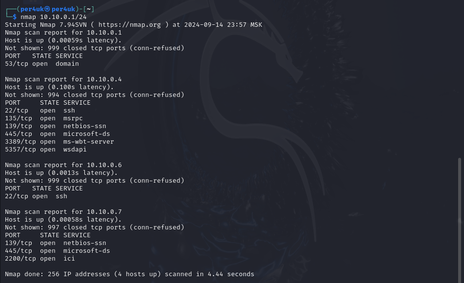
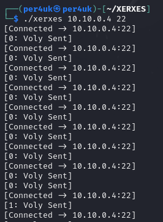
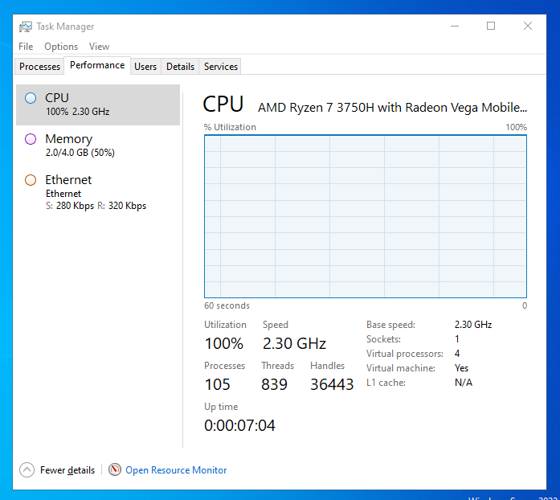

# Урок 8. Типы атак II.

### ***1. Атаки MitM*** ###  
Атака типа «человек посередине» (MitM) также известна как атака с перехватом. Она происходит, когда злоумышленник пытается перехватить связь между двумя сторонами (веб-сервером и клиентским браузером), чтобы следить за жертвой, украсть личную информацию или учетные данные, передаваемые по сети. Для выполнения атаки хакер ищет незащищенные сетевые соединения в общедоступных сетях Wi-Fi. Для предотвращения атак MitM при доступе к сети из незащищенной общедоступной точки доступа Wi-Fi используют виртуальную частную сеть (VPN), обеспечивающую безопасное соединение с шифрованием данных.  
Примечание. В наши дни MitM не широко распространены, так как в большинстве систем электронной почты, чатов используется сквозное шифрование, которое предотвращает вмешательство третьих лиц в данные, передаваемые по сети, независимо от того, является ли сеть безопасной или нет.  
  
Распространенные виды атак типа MitM:  

- Захват сеанса. Злоумышленник захватывает сеанс между клиентом и сетевым сервером. После соединения клиента с сервером, хакер отключает клиента от трафика и заменяет IP-адрес клиентского компьютера своим собственным IP-адресом, подделывая номера клиента. Сервер продолжает сеанс, полагая, что обменивается данными с клиентом. Если IP-адрес злоумышленника вставлен в середине сеанса, сервер может не обнаружит этого, так как пользователь уже задействован в доверенном соединении, то есть прошел проверку подлинности.
- IP-спуфинг. Это подмена IP-адреса пользователя злоумышленником для того, чтобы убедить систему в том, что она взаимодействует с известным доверенным лицом, и предоставить злоумышленнику доступ к системе. Хакер отправляет пакет с IP-адресом источника известного доверенного хоста вместо своего собственного IP-адреса на целевой хост. Целевой хост может принять пакет и действовать в соответствии с ним.  
Атаки типа «человек посередине» опасны для сайтов без шифрования данных при их передаче от клиента к серверам. Это веб-ресурсы, не использующие HTTPS (расширение протокола HTTP для поддержки шифрования). URL-адрес такого веб-сайта начинается с HTTP, а не HTTPS, как рекомендуется. Наличие сертификата безопасности HTTPS также определяют по значку слева в адресной строке. Сайты, использующие протокол HTTPS, имеют символ замкнутого замка, что свидетельствует о защищенном соединении с сайтом.  

Простой способ предотвратить атаку MitM – установить на сайте сертификат Secure Sockets Layer (SSL), обеспечивающий шифрование всей информации, передаваемой между сторонами. Большинство современных провайдеров имеют встроенный сертификат SSL в своем хостинг-пакете. Таким образом, эффективную защиту от атак MitM обеспечивают шифрование и цифровые сертификаты, гарантируя конфиденциальность и надежность связи.
  
### ***2. Отказ в обслуживании (DoS-, DDoS-атаки)*** ###  
Атаки типа «отказ в обслуживании» (DoS, DDoS) перегружают системы, серверы, сайты трафиком для нарушения или прекращения их обслуживания, чтобы сделать его недоступным для посетителей. В результате перегруженного сервера система не может отвечать на запросы пользователей и прекращает свою работу.  

Распределенная атака «отказ в обслуживании» DDoS – тот же метод, что и традиционный DoS, за исключением того, что хакер использует несколько взломанных устройств для запуска атаки трафиком на целевой веб-ресурс в более крупном масштабе. Эта атака сложнее и опаснее, так как выполняется одновременно с разных IP-адресов по всему миру, что затрудняет определение её источника для сетевых администраторов.  
Существуют разные типы DoS- и DDoS-атак, наиболее распространенные из них – TCP SYN flood, smurf, ping-of-death, ботнеты. Злоумышленники часто используют Dos-, DDos-атаки вместе с другими атаками, чтобы отвлечь автоматизированные системы защиты от реагирования на проблему.  
  
Атаки DoS, DDoS используются спонсируемыми государством хакерами, цель которых – нарушить работу иностранных правительств и организаций. Согласно отчету Cisco, веб-сайты Олимпийских игр 2016 года в Рио пострадали от 223 крупномасштабных DDoS-атак. Токио для проведения Олимпийских игр создало совет по кибербезопасности. Атака «отказ от обслуживания» также может принести финансовую выгоду для бизнес-конкурентов, заинтересованных в устранении конкурента для охвата большей части рынка. Исследование рисков информационной безопасности, проведенное «Лабораторией Касперского», показало, что одна DDoS-атака («распределенный отказ в обслуживании») обходится малому бизнесу в 123 тыс. $, а крупным предприятиям в среднем 2,3 млн. $.  

Для предотвращения DoS- и DDoS-атак необходимо уменьшить трафик с помощью сети доставки контента (CDN), балансировщика нагрузки, масштабируемых ресурсов. Также следует использовать брандмауэр на случай, если DDoS-атака скрывает другой метод кибератаки, такой как SQL-инъекция или XSS.  

Межсайтовый скриптинг (XSS), атака с использованием межсайтовых сценариев – атака, при которой злоумышленник загружает в базу данных веб-сайта вредоносный клиентский код (скрипт JavaScripts, реже HTML, VBScript, ActiveX, Flash). Атаки XSS разделяют на три категории: сохраненные (постоянные), отраженные (непостоянные), основанные на DOM.  
Межсайтовый скриптинг происходит следующим образом. Когда пользователь входит на страницу веб-сайта, его браузер автоматически запускает скрипт хакера как часть кода HTML, который выполняет вредоносный сценарий. Вредоносный код может передать файлы cookie из браузера пользователя на сервер злоумышленника, который использует их для перехвата сеанса и дальнейшего извлечения учетных данных клиента, управления его устройством.  
Атака является успешной для уязвимых веб-сайтов, использующих недостаточный уровень кодирования и проверки на наличие вредоносного содержимого веб-запроса. Браузер пользователя не может обнаружить, что вредоносный источник (чаще всего веб-запрос) ненадежный, и предоставляет ему доступ к файлам cookie, токенам сеанса или другой конфиденциальной информации, связанной с сайтом, или позволяет вредоносному сценарию переписывать содержимое HTML.  
Недавнее исследование Precise Security показало, что XSS-атака является наиболее распространенной кибератакой, составляющей примерно 40% всех атак. Основная защита от XSS-атак – правильное кодирование, включая кодирование HTML, атрибутов, кодирование JavaScript, CSS и т. д. Разработчики устанавливают брандмауэры, действующие как фильтр, который выявляет и блокирует любые вредоносные запросы к веб-сайту. Большинство современных веб-хостинговых платформ используют эти функции автоматически.  

### ***4. Парольные атаки*** ###  
Парольная атака – тип кибератаки, при которой злоумышленник пытается взломать пароль пользователя. Существует множество различных способов взлома пароля, в том числе атака грубой силы, атака по словарю, атака по радужной таблице, заполнение учетных данных, распыление паролей, атака кейлоггера.  
Для получения пароля пользователя преступники также используют методы фишинга (попытки обманом заставить жертву передать ценную информацию, такую как пароли, данные кредитной карты и др.), используют ботов для взлома учетных данных, пытаются перехватить сеансы пользователей, не зашифрованные в сети.  
Во избежание взлома паролей рекомендуется настроить функцию блокировки учетной записи при авторизации, которая автоматически блокирует доступ к устройству, веб-сайту или приложению после определенного количества попыток ввода неверного пароля. Владельцы сайта могут потребовать от своих посетителей устанавливать надежные пароли с помощью криптографического алгоритма «хеширования пароля», такого как Bcrypt, Scrypt или Argon2, настроить двухфакторную аутентификацию (2FA), использовать программы-генераторы кодов сеанса, чтобы снизить риск взлома их учетной записи.

### ***5. Вредоносное ПО*** ###   

Вредоносное ПО – это виды вредоносного программного обеспечения, выполняющие вредоносные задачи на устройстве с целью получения злоумышленником учетных или других ценных данных, прерывания работы системы, вымогательства у жертвы денежных средств и пр.  
Вредоносное ПО активируется и заражает компьютер после его загрузки. Это требует определенных действий со стороны пользователя, например, щелчка по ссылке, нажатия кнопки загрузки файла, открытия приложения электронной почты, под которыми скрывается вредоносное ПО.  
Некоторые из наиболее известных типов вредоносных программ – это вирусы, черви, трояны, боты, программы-вымогатели, бэкдоры, шпионское и рекламное ПО. Проникнув в систему, они могут блокировать доступ к сетевым файлам, передавать информацию жертвы с жесткого диска, отслеживать сетевой трафик, нарушать работу системы и полностью отключать её для похищения хакером конфиденциальных данных.  
Согласно отчету Verizon о расследовании утечек данных, основная мотивация киберпреступников – финансовая, поэтому они чаще всего похищают банковские реквизиты и другие данные, открывающие доступ к денежным средствам.  
Для защиты устройства от вредоносного ПО устанавливают антивирусные программы, популярные из которых – Eset NOD32, Антивирус Касперского, Avast!, Symantec Norton Anti-Virus, McAfee VirusScan и др. Антивирусы обнаруживают вредоносные программы, предупреждают о потенциальных угрозах во всплывающем окне и удаляют их.  
Некоторое вредоносное ПО имеет код, который обходит антивирусные программы. Поэтому пользователям важно сохранять бдительность в отношении того, какие сайты они посещают и по каким ссылкам переходят. Атаки потенциально опасных программ также можно предотвратить с помощью межсетевого экрана нового поколения (NGFW), обеспечивающего комплексную сетевую защиту и способного выполнять глубокую проверку пакетов данных с использованием искусственного интеллекта (AI).

### ***6. Атака нулевого дня*** ###   
«Атака нулевого дня» – атака, при которой киберпреступники обнаруживают сетевые уязвимости в безопасности широко используемого программного обеспечения (Microsoft Windows, Google Chrome), операционных системах, и атакуют эти ресурсы до того, как исправление станет доступным. Атака предшествует обновлению ПО, который рассматривается «первый день», поэтому называется «атакой нулевого дня».  
Хакеры действуют по двум сценариям: ищут уязвимости в обновлениях или исправлениях системы безопасности ПО для сайта или сервера, который своевременно не обновил систему, и используют их целью атаки. В обоих случаях безопасность сайта оказывается под угрозой, и последующий ущерб зависит от навыков злоумышленников. Лучший способ защитить себя и свой сайт от атак нулевого дня – обновлять программное обеспечение сразу после того, как разработчики предложат новую версию.

### **Домашнее задание** ###   
1. Команда top до запуска XERXES:  
  
  
2. Команда top после запуска XERXES:  
 
  
3. Далее была осуществлена атака WindowServer. Сначала с помощью nmap сканировалась сеть на наличие узлов и открытых портов.  
  
  
4.У узла с IP 10.10.0.4 открытый порт 22, по которому далее была осуществлена атака (ранее на данном узле был развернут SSH-server).  
  
  
5. Результат атаки представлен ниже.  
  

