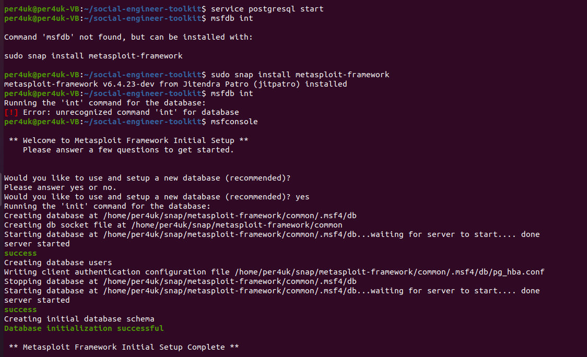
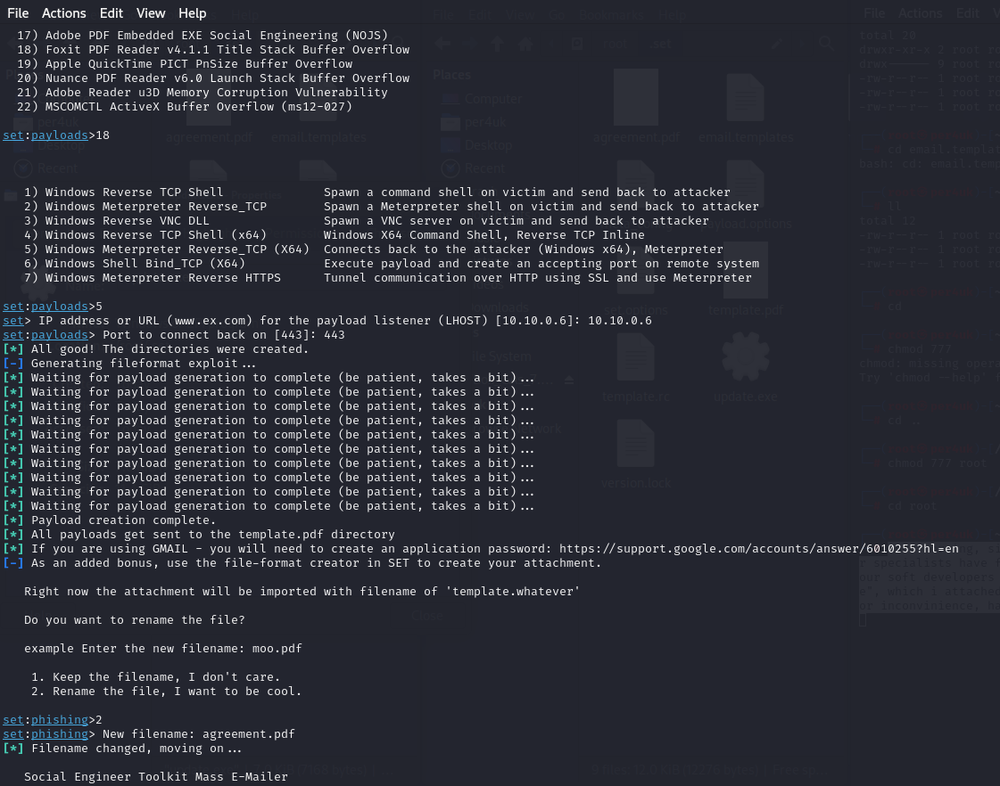
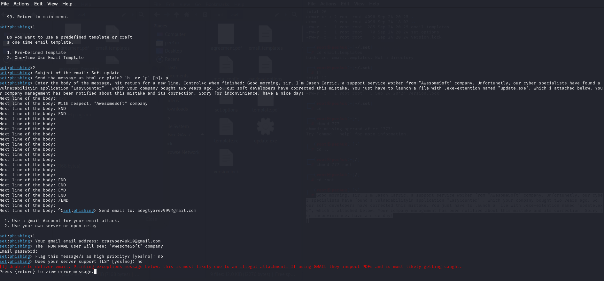
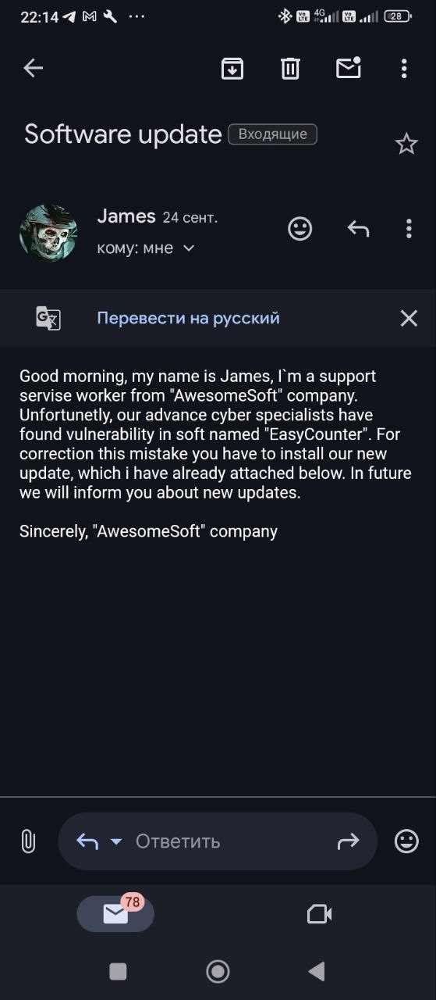

# Урок 9. Социальная инженерия (social engineering).

### ***Социальная инженерия*** ###  
это метод манипуляции людьми с целью получения их конфиденциальной информации, доступа к ресурсам или других представляющих ценность объектов. Киберпреступники прекрасно овладели искусством обмана: они знают, как убедить ничего не 
подозревающих пользователей поделиться своими данными, распространить вредоносную программу или открыть доступ к системам, не предназначенным для посторонних. Атаки происходят не только в Сети, но также при личном общении и других видах 
взаимодействия.  

### ***Основные цели:*** ### 
- Диверсия: причинение вреда или неудобств в результате повреждения данных.  
- Кража: получение ценной информации, доступа к ресурсам или денег.  

### ***Стадии:*** ### 
- Подготовка. Сбор информации о жертве или группе, к которой она принадлежит.  
- Проникновение. Установление контакта и завоевание доверия.  
- Эксплуатация. Поиск и использование уязвимости жертвы.  
- Исчезновение. Прекращение общения с жертвой после достижения поставленной цели.  

### ***Особенности атак на основе социальной инженерии:*** ### 
Хорошего социального инженера отличает уверенность в себе и мастерство убеждения. Тактики, используемые злоумышленниками, заставляют людей делать то, чего они никогда не сделали бы в других обстоятельствах.  
В большинстве случаев специалисты по социнженерии используют следующие приемы.  
1) Играют на эмоциях. Эмоциональные манипуляции позволяют злоумышленникам добиваться своего практически в любой ситуации. Под воздействием эмоций люди нередко совершают нелогичные и даже рискованные поступки. Чтобы достичь свей цели, преступник может попытаться вызвать у жертвы следующие эмоции.  
- Страх  
- Волнение  
- Любопытство  
- Злость  
- Вина  
- Огорчение  
2) Создают ощущение срочности. Уникальные предложения с ограниченным сроком действия или срочные запросы информации пользуются у мошенников не меньшей популярностью. Узнав, что вам грозит проблема, требующая незамедлительного решения, вы можете забыть о безопасности и передать злоумышленнику свои конфиденциальные данные. Также вас могут обмануть обещанием награды или приза, которые нужно забрать прямо сейчас, пока карета не превратилась в тыкву. Оба подхода призваны отключить ваше критическое мышление.  

3) Входят в доверие. Правдоподобность – ключевой аспект любой атаки с применением социальной инженерии, важность которого сложно переоценить. Мошенник заведомо вас обманывает, и в этой ситуации для него главное – быть убедительным. У него есть достаточно информации для того, чтобы сочинить историю, которой вы поверите без лишних вопросов.

Но есть и исключения. Иногда злоумышленники выбирают более простые методы для проникновения в вашу сеть или устройство. Например, они могут проводить много времени на фуд-кортах больших офисных зданий и заглядывать в экраны посетителей, работающих на планшете или ноутбуке. Так они могут насобирать множество учетных данных – и для этого даже не нужно делать рассылку или писать вирус.  

### ***Виды атак с использованием социальной инженерии*** ### 
1) Фишинговые атаки  
Существует два вида таких атак:
- Спам-рассылки, или массовый фишинг, – это распространенный тип атаки на многих людей сразу. Они не персонализированы – преступники пытаются поймать какого-нибудь доверчивого пользователя.  
- Целевой фишинг и его разновидность, уэйлинг, – это персонализированные атаки на конкретных пользователей. Жертвами уэйлинга обычно становятся знаменитости, представители высшего руководства компаний и политики.  

В ход может пойти все, что вы сообщите мошеннику – как при непосредственном общении, так и при заполнении фейковых онлайн-форм. Преступник может даже убедить вас загрузить на свое устройство вредоносную программу для исполнения следующего этапа фишинговой атаки. Фишинговые сообщения могут доставляться жертве по разным каналам.  

Голосовой фишинг («вишинг»). Вам может позвонить робот, который будет записывать все, что вы ему говорите, включая личные данные. Иногда с жертвой беседует человек – так он может завоевать ее доверие и создать ощущение срочности.  

SMS-фишинг («смишинг»). Жертва получает SMS или сообщение в мессенджере со ссылкой на веб-ресурс или рекомендациями дальнейших действий с поддельного номера телефона.  

Фишинговые письма. Это традиционный вид фишинга: вам приходит письмо, отправитель которого просит вас ответить или совершить другие действия. Такие письма могут содержать ссылки на веб-ресурсы, телефонные номера или вредоносные вложения.  

Angler-фишинг. Злоумышленники создают поддельные страницы службы поддержки клиентов доверенных компаний в социальных сетях. Заметив вашу переписку с известным брендом, они от лица компании предлагают вам обсудить ваш вопрос в личных сообщениях, где и продолжают атаку.  

Фишинг в поисковых системах. Злоумышленники размещают ссылки на фейковые сайты в топе результатов поиска. Для манипуляции поисковым ранжированием используется платная реклама или легитимные методы оптимизации.  

URL-фишинг. Злоумышленники распространяют ссылки на фишинговые сайты по электронной почте, через текстовые сообщения, социальные сети и онлайн-рекламу. Злоумышленники создают ссылки, похожие на адреса известных сайтов, или используют текст с гиперссылками, кнопки и инструменты для генерации коротких URL для маскировки.  

Внутрисессионный фишинг. Во время такой атаки злоумышленники вмешиваются в вашу работу в интернете. Например, на просматриваемой странице может всплыть фальшивое окно с полями для ввода учетных данных.  

2) Рыбалка на живца  
Во время атаки «на живца» злоумышленник рассчитывает на ваше природное любопытство. В качестве приманки он предлагает вам что-то бесплатное и эксклюзивное. Как правило, в результате такой атаки на ваше устройство попадает вредоносная программа.  

Вот самые распространенные способы атаки «на живца».  

- Оставляют флешку в общественных местах, например в библиотеках или на парковках.  
- Рассылают вредоносные вложения в письмах, например информацию о бесплатном предложении или якобы бесплатное ПО.

3) Физические угрозы  
Физические угрозы – это ситуации, в которых злоумышленник встречается с жертвой лично, выдавая себя за доверенное лицо, чтобы получить доступ к сетям или данным, которые закрыты для посторонних.  

Такие атаки обычно происходят в корпоративных средах, например в государственных учреждениях, коммерческих и других организациях. Злоумышленник может выдавать себя за представителя известного доверенного контрагента. Иногда такие атаки совершают уволенные сотрудники компании, решившие отомстить бывшему работодателю.  

Они стараются скрыть свою личность, но ведут себя довольно убедительно, чтобы избежать ненужных вопросов. Такие атаки связаны с большим риском и требуют тщательной подготовки. Как правило, злоумышленники выбирают этот метод только тогда, когда все ходы просчитаны, а игра стоит свеч.  

4) Тейлгейтинг
Тейлгейтинг – это незаконное проникновение на закрытую территорию вместе с уполномоченным сотрудником. Злоумышленник может воспользоваться вашей вежливостью, попросив придержать для него дверь, или убедить вас в том, что ему тоже разрешено находиться в закрытой зоне. Для достижения своей цели он может использовать ложные предлоги.

5) «Ты – мне, я – тебе»  
«Ты – мне, я – тебе», или «услуга за услугу», – это вид фишинговой атаки, когда злоумышленник предлагает жертве вознаграждение или другие преимущества в обмен на персональные данные. Например, преступники предлагают поучаствовать в исследовании или розыгрыше призов.  

Они заманивают жертву выгодными предложениями, не требуя больших вложений с ее стороны. В итоге они просто забирают данные и исчезают, а вознаграждения жертва так и не получает.  

6) DNS-спуфинг и отравление DNS-кеша
DNS-спуфинг – это атака, во время которой преступники перехватывают ваши запросы к веб-серверам и перенаправляют вас на другие сайты. После заражения эксплойт будет перенаправлять вас на указанные злоумышленником сайты до тех пор, пока из задействованных систем не будут удалены искаженные данные о маршрутизации.  

Отравление DNS-кеша – это атака, во время которой на ваше устройство поступает команда о замене легитимного URL-адреса или нескольких URL-адресов на адрес вредоносного сайта.  

7) Фальшивые антивирусы
Фальшивые антивирусы – это вредоносные программы, которые пугают пользователя с целью манипуляции его поведением. Они генерируют фейковые оповещения о заражении вашего устройства или взломе вашей учетной записи.  

Ключевая цель – заставить вас купить мошенническое антивирусное ПО или вытянуть из вас личную информацию, например учетные данные.  

## ***Домашнее задание*** ## 
1) Для начала совместно с установкой setoolkit был установлен metasploit, поскольку часть функционала setoolkit запрашивала установку данного фреймворка. Данные фреймворки были установлены как на Kali Linux, так и Ubuntu.
  
  
  
2) Создание фишингового сайта. Для выполенения данного действия был создан сайт-клон почты mail.ru, после чего, зайдя на него с ВМ Windows 10 были получены данные (логин, пароль) потенциальной жертвы.

  

3) Создание pdf c полезной нагрузкой для "прослушивания" пк жертвы. В результате был создан pdf-файл, однако его не получилось отправить по почте в виду его содержимого.  
  
  

  

4) Реализация целевого фишинга в виде отправление письма жертве, о которой предварительно собирались данные с целью достижения своих целей посредством невнимательности жертвы. (update.exe также не получилось отправить из-за его содержимого)
  

